# Setup Hortonworks Sandbox in Azure Cloud

The Azure cloud infrastructure has become a commonplace for users to deploy virtual machines on the cloud due to its’ flexibility, ease of deployment, and cost benefits. In addition, Microsoft has expanded Azure to include a marketplace with thousands of certified, open source, and community software applications, developer services, and data—pre-configured for Microsoft Azure. This tutorial covers deploying the HDP Sandbox 
offering from the Azure Marketplace.

## Creating the Hortonworks Sandbox VM
1.	Go to https://portal.azure.com and on the dashboard click on the Create a resource menu item.  

	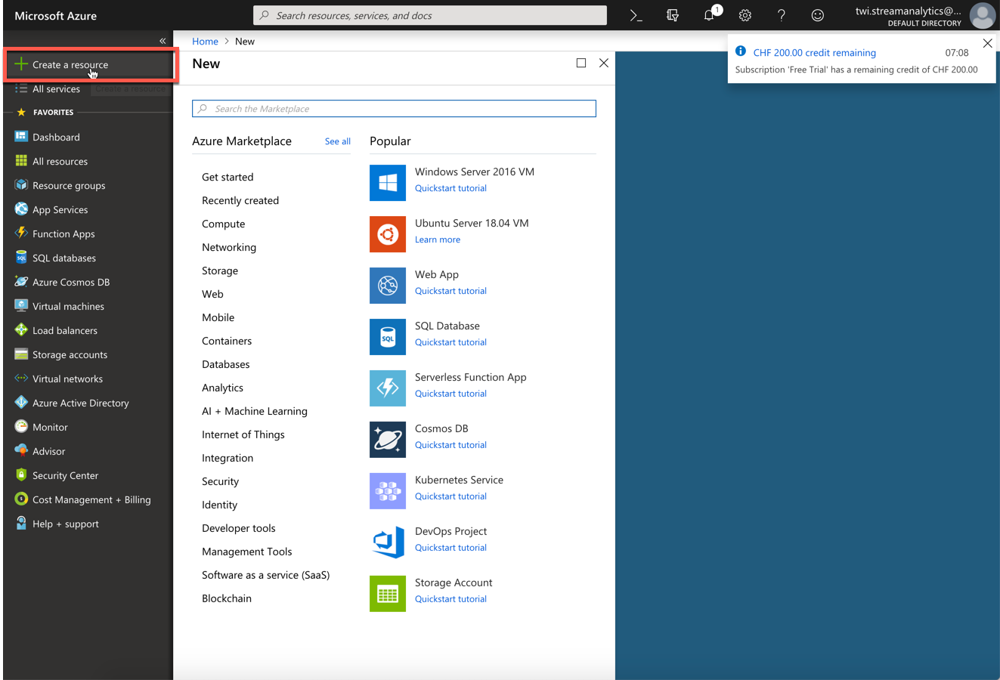

2.	Type **hortonworks** into the search bar and select the **Hortonworks Sandbox with HDP 2.6.4** option

	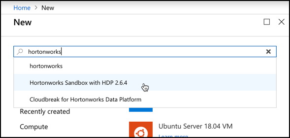

3.	On the next page some information on the Sandbox is shown. 

	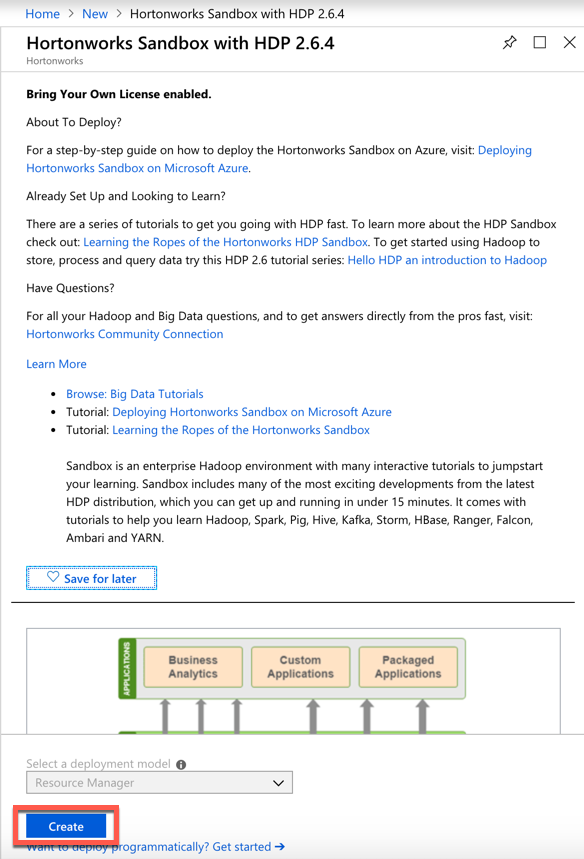

4. Click **Create**.
5. The **Create a Virtual Machine** page will show up.

	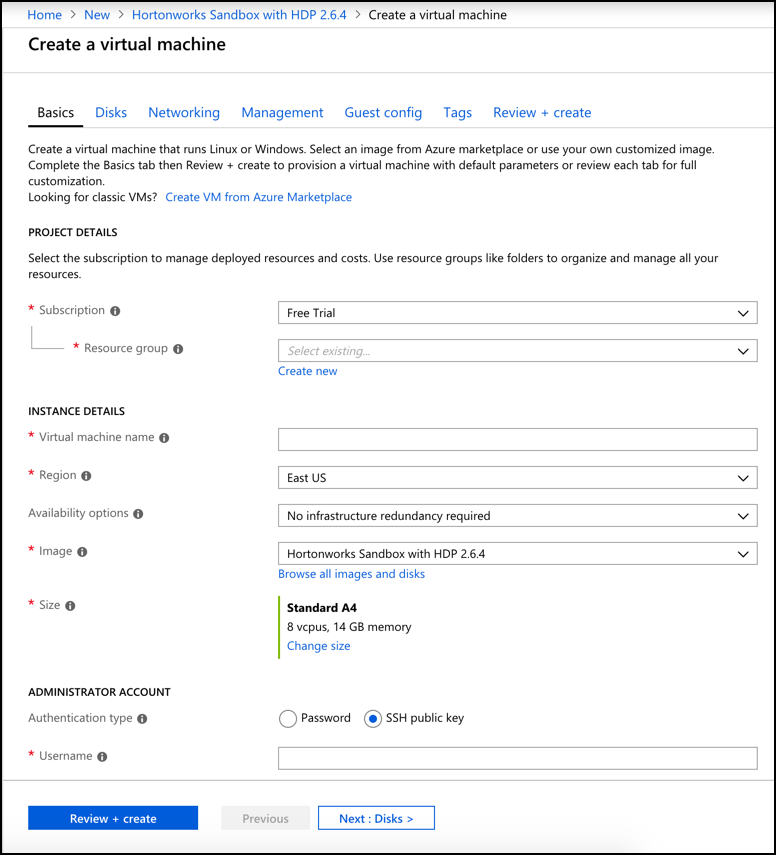

6. **Subscription** should be preset with **Free Trial**.  
7. At the **Resource group** field, click on **Create New** and enter **hdp-rg** into the pop-up window and click **OK**.
8. Make sure that **hdp-rg** is selected for the **Resource Group**.
8. Enter **hdp** into the **Virtual Machine name** field. 
9. Select **West Europe** for the **Region** drop-down.
10. Under **Size** select the desired VM size. Select **Standard A5** as the default A4 is too large for the **Free Trial** subscription.
11. Select **Password** as the **Authentication Type**.
12. Enter a **Username** and **Password** you will remember. 
14. Click on **Allow selected ports** and in the **Select inbound ports** drop-down select **HTTTP (80)** and **SSH (22)**. 
15. Click on **Next: Disks >** to move to the next page.

	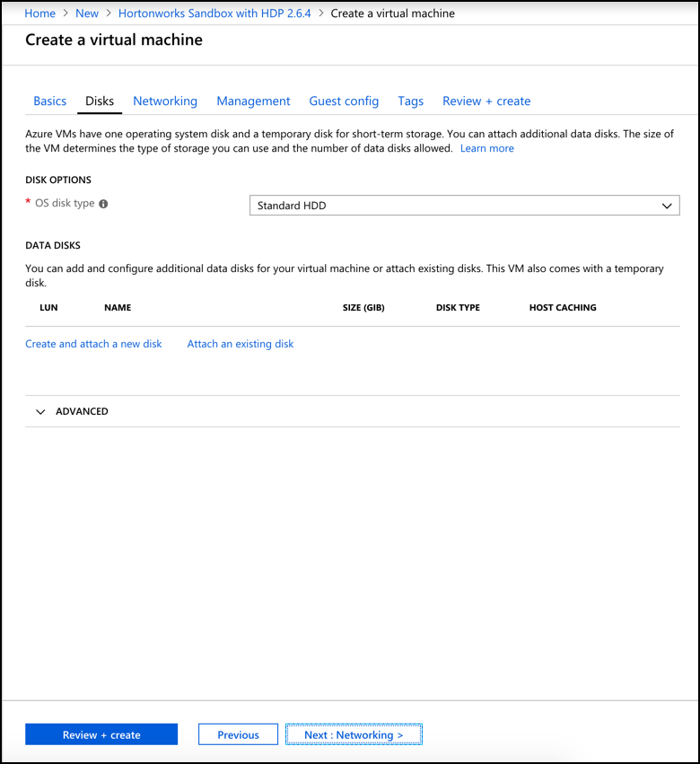

14. Leave **OS disk type** on **Standard HDD** and click **Next : Networking >**.

	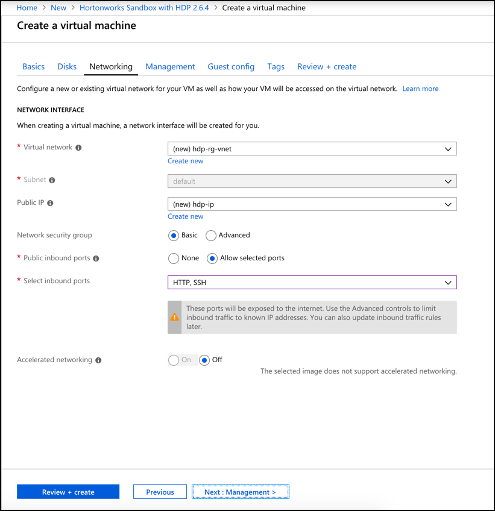

15. Make sure that the **Virtual Network** is set to **hdp-rg-vnet**.	
15. Leave everything as is and click **Next : Management >**.

	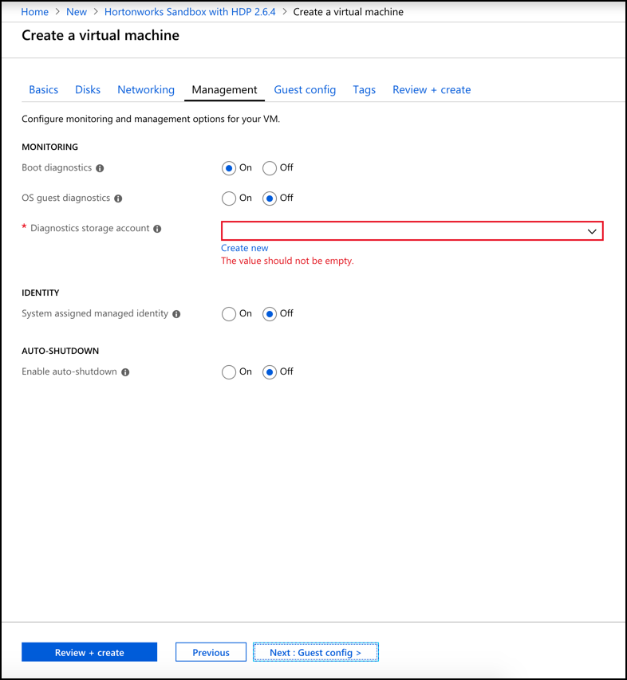

16. Select **Off** for **Boot Diagnostics**.
17. Select **On** for **Enable auto-shutdown** and enter the time of the shutdown into the **Shutdown time** field.
18. Click **Next : Guest config >** and click **Next : Tags >** and click **Next : Review + create >**.

	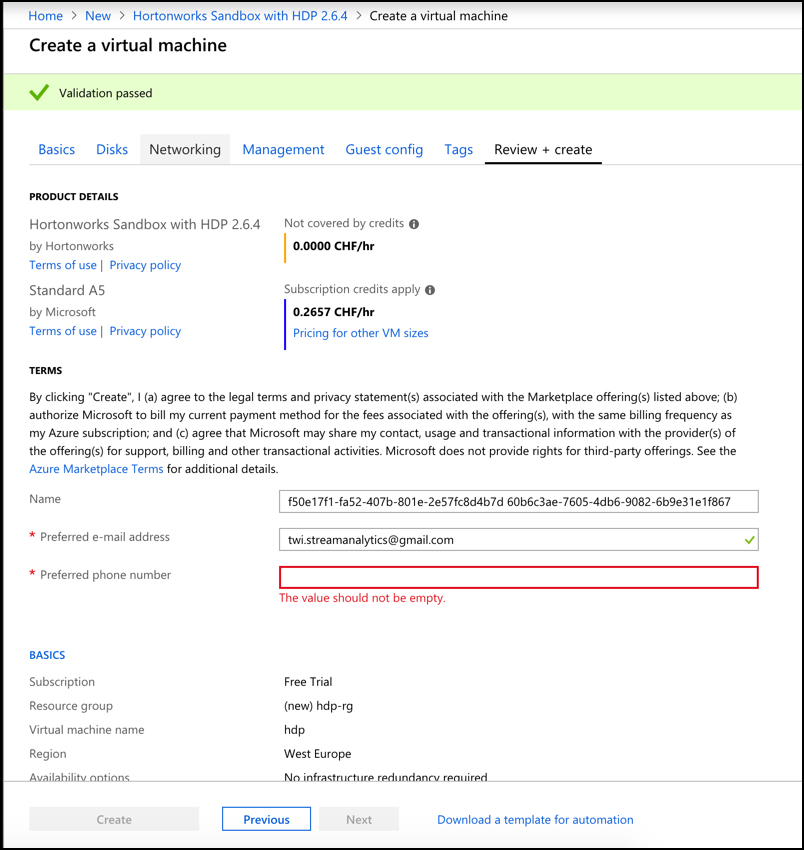

19. The validation should pass successfully. You can also see the price of the selected VM size in CHF per hour. 
20. Enter your phone number into the **Preferred phone number** field and click **Create**. 

21. You will be brought back to the dashboard. A page saying that the deployment is on its way should be shown. It will take a while until the virtual machine is available 

22. You can follow the status of the creation by clicking on the **Notifications** button on the top. 

	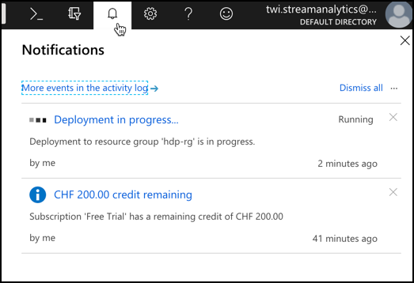

23. Once the virtual machine is deployed the following screen is displayed in the portal.

	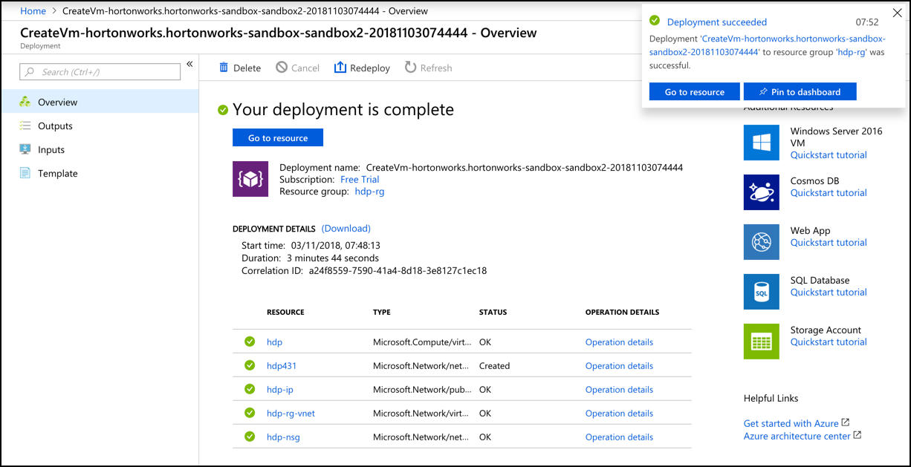

24. Click on **Pin to dashboard** to show the newly created machine on the dashboard.

This finishes the provisioning of the new virtual machine. 

## Open other ports

Hadoop provides a lot of web-based applications. In order to use them from outside the virtual machines, access to the corresponding ports have to be allowed. 

1. Click on **Dashboard** and select the **hdp** resource. 

	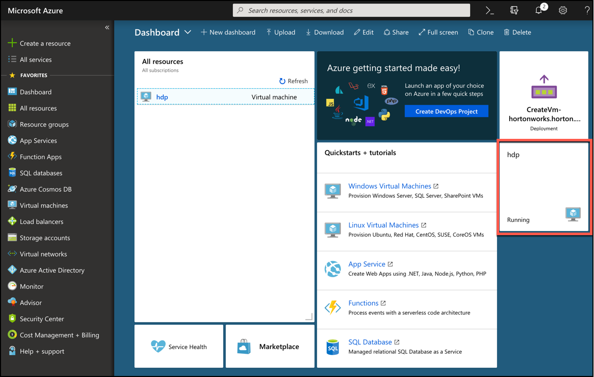

2. On the virtual machine details page on the left side, click on **Networking**. 

	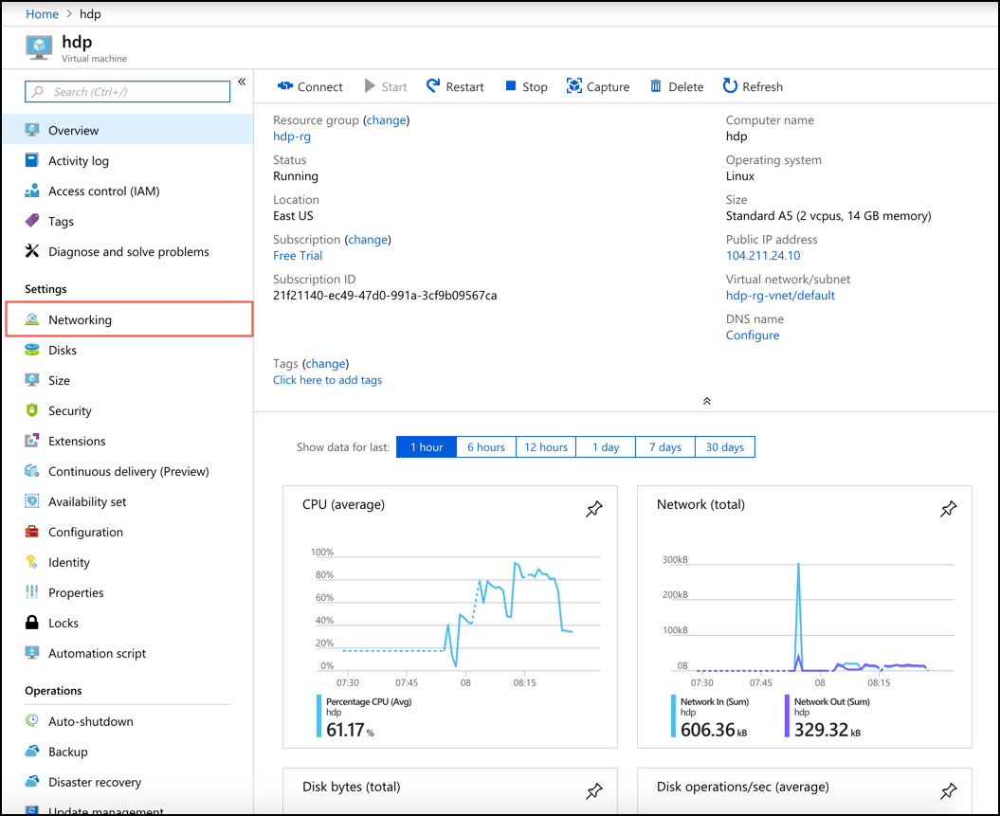

2. Click on **Add inbound port rule**.

	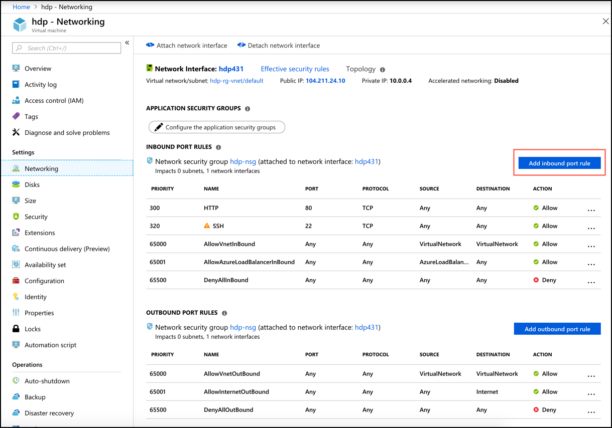
	
3. On the **Add inbound security rule** pop-up window, enter the port **8888** to the **Destination port ranges** and in the **Name** change the name to reflect the port **Port_8888**

	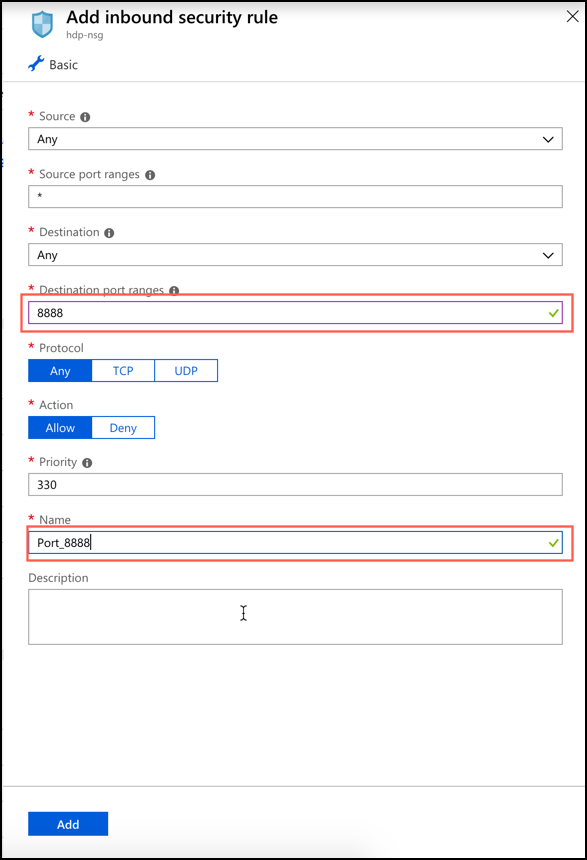
	
4. Click **Add**.

5. Repeat these steps for the following ports: 8080, 4200, 9995

## Accessing the Virtual Machine

1. Click on **Dashboard** and select the **hdp** resource. 

2.	Take note of the IP address. In this example, it is **104.211.24.10** and highlighted in a red box. Your machine will of course have a different IP. 

	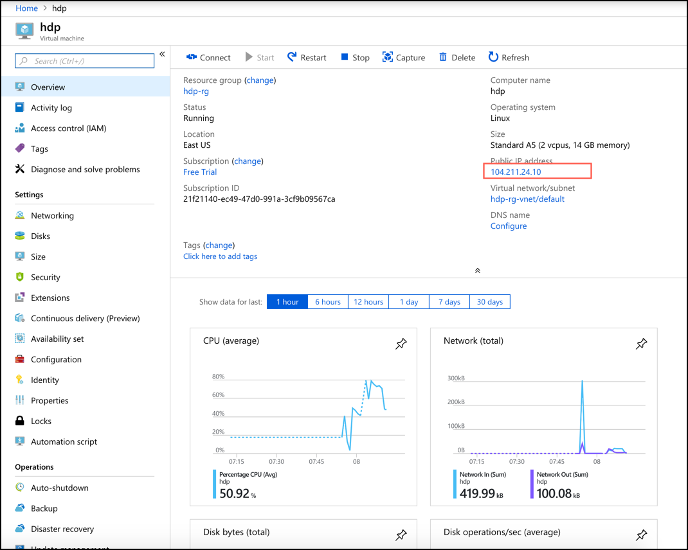

3.	To simplify working with the sandbox, an entry to the hosts file (`/etc/hosts` on Linux/Max or `C:\Windows\System32\Drivers\etc\hosts` on windows) can be added. This way we can use the alias instead of the IP address. The rest of the workshops, assume that this entry has been made.

	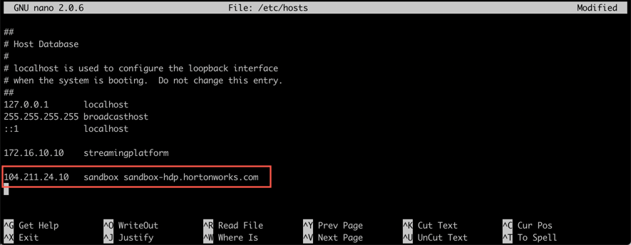

3. Open a new browser window and navigate to <http://sandbox:8888>. You should reach the following Hortonworks landing page.

	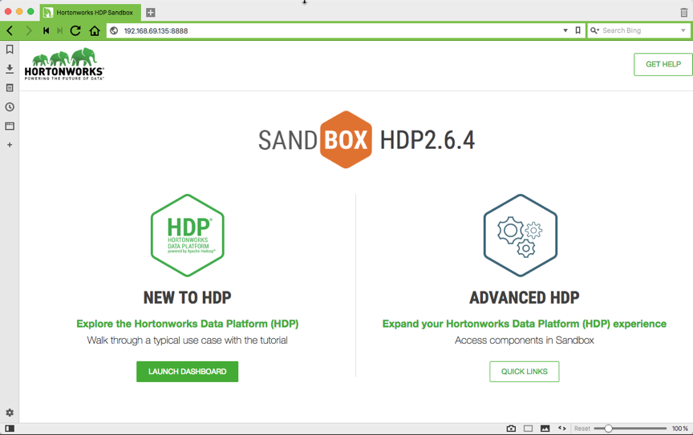

18.	Click on **Quick Links** on **Advanced HDP** to view the various links for the different tools.

	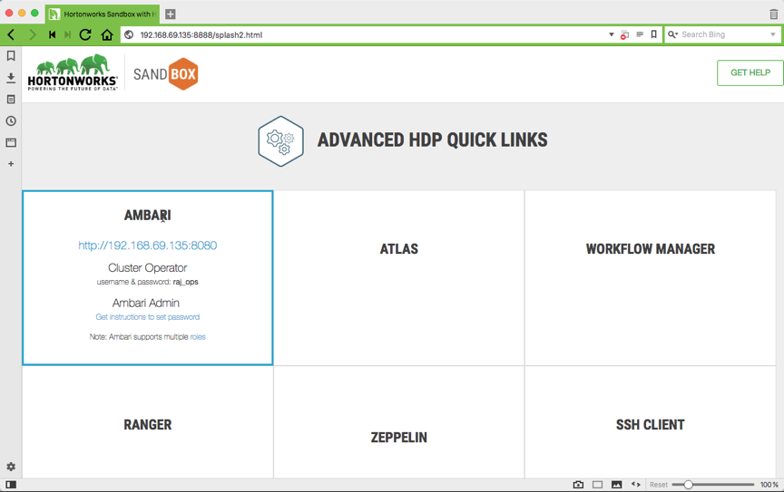


In the Overview of HDP you can find an architectural breakdown of Apache Hadoop and the Hortonworks Data Platform.

##Accessing CLI

To access the sandbox through a terminal you can either connect through a SSH client or use the built-in web client, if you don’t have a SSH client installed.

Access the build-in Web client, click on the link under advanced options (<http://sandbox:4200/>. Enter the username and password as entered above when creating the VM. 

Access the sandbox over a SSH client (Terminal on Linux / Mac, Putty on Windows). In the terminal, enter the following command

```
ssh root@sandbox -p 2222
```


##Services Provided by the Sandbox

Service  | URL
------------- | -------------
Sandbox Welcome Page | <http://sandbox:8888>
Ambari Dashboard	 | <http://sandbox:8080>
Ambari Views | <http://sandbox:8080/#/main/views>
Hive 2.0 View | <http://sandbox:8080/#/main/view/HIVE/auto_hive20_instance>
File View | <http://sandbox:8080/#/main/view/FILES/auto_files_instance>
SSH Web Client | <http://sandbox:4200>
Zeppelin| <http://sandbox:9995>
