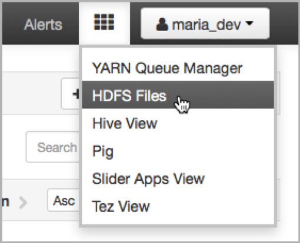
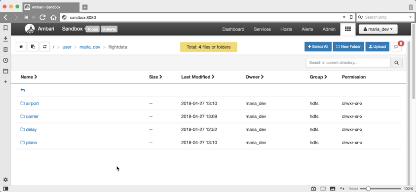
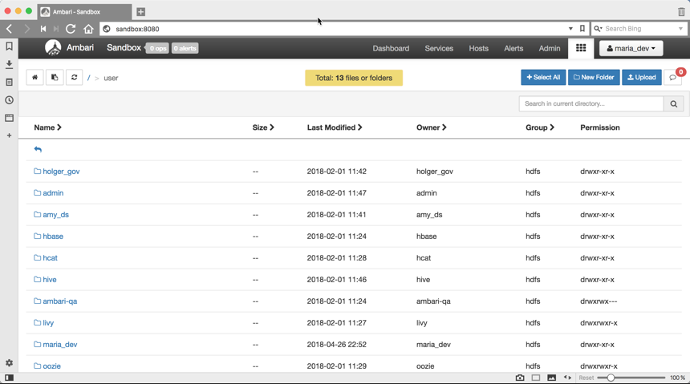
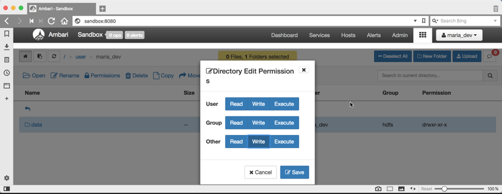

# Loading Sensor Data Into HDFS
## Introduction
In this section, you will download the sensor data and load that into HDFS using Ambari User Views. You will get introduced to the Ambari Files User View to manage files. You can perform tasks like create directories, navigate file systems and upload files to HDFS.  In addition, you’ll perform a few other file-related tasks as well.  Once you get the basics, you will create two directories and then load two files into HDFS using the Ambari Files User View.

## Prequisites
 * Create a HDP sandbox VM on Azure or download the latest Hortonworks Sandbox
 * Data Set Used: Flights
 * Optional: Hortonworks ODBC driver installed and configured

##	HDFS
A single physical machine gets saturated with its storage capacity as the data grows. This growth drives the need to partition your data across separate machines. This type of File system that manages storage of data across a network of machines is called Distributed File Systems. HDFS is a core component of Apache Hadoop and is designed to store large files with streaming data access patterns, running on clusters of commodity hardware. With Hortonworks Data Platform HDP, HDFS is now expanded to support heterogeneous storage  media within the HDFS cluster.

### Download and Extract the flight data files
1.	Download the sample data

```
mkdir flight
cd flight
curl http://stat-computing.org/dataexpo/2009/2008.csv.bz2 -o 2008.csv.bz2
bzip2 -d 2008.csv.bz2

curl http://stat-computing.org/dataexpo/2009/airports.csv -o airports.csv
curl http://stat-computing.org/dataexpo/2009/plane-data.csv -o plane-data.csv
curl http://stat-computing.org/dataexpo/2009/carriers.csv -o carriers.csv

```

### Load the flight data into HDFS
1.	Go to the Ambari Dashboard and open the HDFS Files view. Click on the 9 square Ambari User Views icon next to the username button and select the HDFS Files menu item.

	

2. Start from the top root of the HDFS file system, you will see all the files the logged in user (maria_dev in this case) has access to see:

	


3. Click user folder and then on the `maria_dev` folder. Then click **New Folder** button to create a **flightdata** directory inside maria_dev folder. Now navigate into the `flightdata` folder.
4.	Within flightdata, create a folder **delay**, **airport**, **carrier** and **flight**.

	

5.	Then upload the `airports.csv`, `carriers.csv`, `plane-data.csv` into the corresponding folders, and `2008.csv` files into the delay folder. 
6.	Navigate to meta, and click Upload and then either 
	* drag file by file onto the area or 
	* click Browse and select a file. Click on Open and then Upload. Repeat for all the other remaining files.

	You can also perform the following operations on a file by right clicking on the file: Download, Move, Permissions, Rename and Delete.

7.	Select the folder flightdata which is contained within the directory path `/user/maria_dev`. 

8.	Select Permissions. Make sure that the background of all the write boxes are checked (blue). Click Save.

	
	
### Using the command line 
The File System (FS) shell includes various shell-like commands that directly interact with the Hadoop Distributed File System (HDFS) as well as other file systems that Hadoop supports, such as Local FS, HFTP FS, S3 FS, and others.

1.	Open a shell into the Hortonworks sandbox, either through the browser-based console or through SSH/putty.
2.	Let’s print the files in the folder just created above
3. Get the content of one of the files and print it to standard output
4. Count the number of directories, files and bytes under the paths that match the specified file pattern. The output columns with -count are:

	DIR_COUNT, FILE_COUNT, CONTENT_SIZE FILE_NAME
	
5.	Display sizes of files and directories contained in the given directory or the length of a file in case it’s just a file

## Summary
We learned Hadoop Distributed File System (HDFS) was built to manage storing data across multiple machines. Now we can upload data into the HDFS using Ambari’s HDFS Files view.


