# Data Manipulation with Hive
In this workshop we will work with Hive to analyze data through SQL.

##Introduction
In this tutorial, you will be introduced to Apache(TM) Hive. In the earlier section, we covered how to load data into HDFS. So now you have geolocation and trucks files stored in HDFS as csv files. In order to use this data in Hive, we will guide you on how to create a table and how to move data into a Hive warehouse, from where it can be queried. We will analyze this data using SQL queries in Hive User Views and store it as ORC. We will also walk through Apache Tez and how a DAG is created when you specify Tez as execution engine for Hive. Let’s start..!!

##Pre-Requisites
* Create a HDP sandbox VM on Azure or download the latest Hortonworks Sandbox
* Workshop 2: Load data into HDFS. You can get the important data for this
workshop by downloading the ZIP file from here: https://bit.ly/2jYXQBf

## Hive
Hive is an SQL like query language that enables analysts familiar with SQL to run queries on large volumes of data. Hive has three main functions: data summarization, query and analysis. Hive provides tools that enable easy data extraction, transformation and loading (ETL).

### Become Familiar with Ambari Hive User view
Apache Hive presents a relational view of data in HDFS and ensures that users need not worry about where or in what format their data is stored. Hive can display data from RCFile format, text files, ORC, JSON, parquet, sequence files and many of other formats in a tabular
view. Through the use of SQL you can view your data as a table and create queries like you would in an RDBMS.
To make it easy to interact with Hive we use a tool in the Hortonworks Sandbox called the Ambari Hive User View. Ambari Hive User View provides an interactive interface to Hive. We can create, edit, save and run queries, and have Hive evaluate them for us using a series of MapReduce jobs or Tez jobs.

1. Navigate to Abmari on <http://sandbox:8080>
2. Logon to Ambari as user **maria_dev**/**maria_dev**.
3. Let’s open the Ambari Hive View. Go to the Ambari User View icon and select **Hive View 2.0**:

	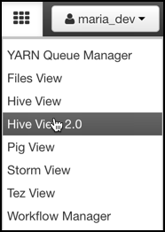

4. The Ambari Hive User View looks like the following:

Now let’s take a closer look at the SQL editing capabilities in the User View:

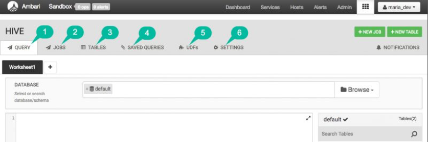

1. There are 6 tabs to interact with SQL:
	* **QUERY:** This is the interface shown above and the primary interface to
write, edit and execute new SQL statement
   * **JOBS:** This allows you to see past and currently running queries. It also
allows you to see all SQL queries you have authority to view. For example, if you are an operator and an analyst needs help with a query, then the Hadoop operator can use the History feature to see the query that was sent from the reporting tool.
	* **TABLES:** Provides one central place to view, create, delete, and manage tables.
	* **SAVED QUERIES:** Display queries saved by current user. Click the gear icon
to the right of the query to open saved query in worksheet to edit or execute.
You can also remove saved query from the saved list. 
	* **UDFs:** User-defined functions (UDFs) can be added to queries by pointing to a
JAR file on HDFS and indicating the Java classpath, which contains the UDF definition. After the UDF is added here, an Insert UDF button appears in the
Query Editor that enables you to add the UDF to your query.
	* **SETTINGS:** Allows you to modify settings which will affect queries executed in Hive View.

Take a few minutes to explore the various Hive User View features.

### Define a Hive Table
Now that you are familiar with the Hive User View, let’s create the initial staging tables for the geolocation and trucks data. In this section we will learn how to use the Ambari Hive User View to create four tables: geolocation_stage, trucking_stage, geolocation, trucking.
First we are going to create the two tables to stage the data in their original csv text format and then will create two more tables where we will optimize the storage with ORC. Here is a visual representation of the Data Flow:

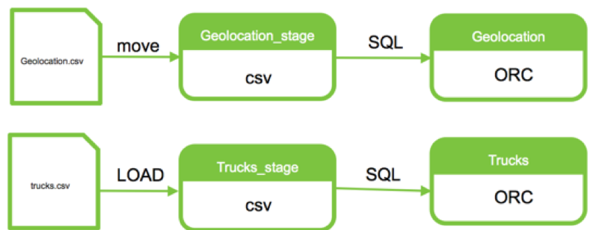	
#### Create Table GEOLOCATION_STAGE for staging initial load
1. Copy-and-paste the the following table DDL into the empty Worksheet of the Query Editor to define a new table named geolocation_stage:

	```
	CREATE TABLE geolocation_stage (truckid string, driverid string, event string, latitude DOUBLE, longitude DOUBLE, city string, state string, velocity BIGINT, event_ind BIGINT, idling_ind BIGINT)
	ROW FORMAT DELIMITED
	FIELDS TERMINATED BY ','
	STORED AS TEXTFILE
	TBLPROPERTIES ("skip.header.line.count"="1");
	```

2. Click the green **Execute** button to run the command. If successful, you should see the **Succeeded** status in the **Query Process Results** section:

	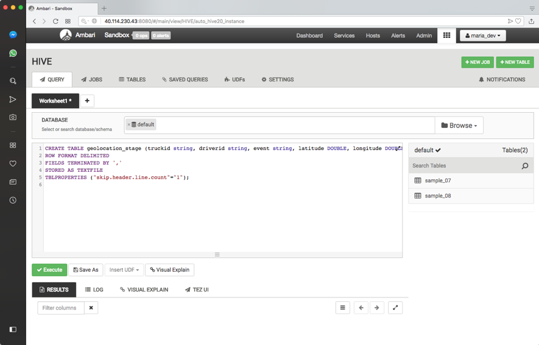

3. Click the blue **New Worksheet** Button.

	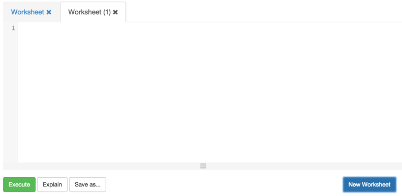

4. Notice the tab of your new Worksheet is labeled **Worksheet (1)**. Double click on this tab to rename the label to “trucks_stage”:

	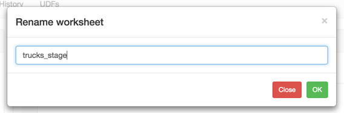

#### Create Table trucks_stage for Staging Initial Load

1. Copy-and-paste the following table DDL into your **trucks_stage** worksheet to define a new table named "trucks_stage":


	```
	CREATE TABLE trucks_stage(driverid string, truckid string, model string, jun13_miles bigint, jun13_gas bigint, may13_miles bigint, may13_gas bigint, apr13_miles bigint, apr13_gas bigint, mar13_miles bigint, mar13_gas bigint, feb13_miles bigint, feb13_gas bigint, jan13_miles bigint, jan13_gas bigint, dec12_miles bigint, dec12_gas bigint, nov12_miles bigint, nov12_gas bigint, oct12_miles bigint, oct12_gas bigint, sep12_miles bigint, sep12_gas bigint, aug12_miles bigint, aug12_gas bigint, jul12_miles bigint, jul12_gas bigint, jun12_miles bigint, jun12_gas bigint,may12_miles bigint, may12_gas bigint, apr12_miles bigint, apr12_gas bigint, mar12_miles bigint, mar12_gas bigint, feb12_miles bigint, feb12_gas bigint, jan12_miles bigint, jan12_gas bigint, dec11_miles bigint, dec11_gas bigint, nov11_miles bigint, nov11_gas bigint, oct11_miles bigint, oct11_gas bigint, sep11_miles bigint, sep11_gas bigint, aug11_miles bigint, aug11_gas bigint, jul11_miles bigint, jul11_gas bigint, jun11_miles bigint, jun11_gas bigint, may11_miles bigint, may11_gas bigint, apr11_miles bigint, apr11_gas bigint, mar11_miles bigint, mar11_gas bigint, feb11_miles bigint, feb11_gas bigint, jan11_miles bigint, jan11_gas bigint, dec10_miles bigint, dec10_gas bigint, nov10_miles bigint, nov10_gas bigint, oct10_miles bigint, oct10_gas bigint, sep10_miles bigint, sep10_gas bigint, aug10_miles bigint, aug10_gas bigint, jul10_miles bigint, jul10_gas bigint, jun10_miles bigint, jun10_gas bigint, may10_miles bigint, may10_gas bigint, apr10_miles bigint, apr10_gas bigint, mar10_miles bigint, mar10_gas bigint, feb10_miles bigint, feb10_gas bigint, jan10_miles bigint, jan10_gas bigint, dec09_miles bigint, dec09_gas bigint, nov09_miles bigint, nov09_gas bigint, oct09_miles bigint, oct09_gas bigint, sep09_miles bigint, sep09_gas bigint, aug09_miles bigint, aug09_gas bigint, jul09_miles bigint, jul09_gas bigint, jun09_miles bigint, jun09_gas bigint, may09_miles bigint, may09_gas bigint, apr09_miles bigint, apr09_gas bigint, mar09_miles bigint, mar09_gas bigint, feb09_miles bigint, feb09_gas bigint, jan09_miles bigint, jan09_gas bigint)
	ROW FORMAT DELIMITED
	FIELDS TERMINATED BY ','
	STORED AS TEXTFILE
	TBLPROPERTIES ("skip.header.line.count"="1");
	```

	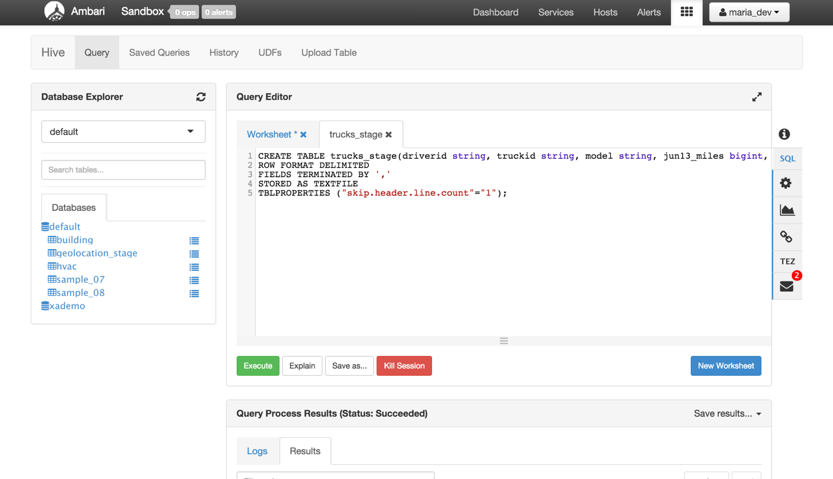

Let’s review some aspects of the **CREATE TABLE** statements issued above. If you have an SQL background this statement should seem very familiar except for the last 3 lines after the columns definition:

* The **ROW FORMAT** clause specifies each row is terminated by the new line character.
* The **FIELDS TERMINATED BY** clause specifies that the fields associated with the
table (in our case, the two csv files) are to be delimited by a comma.
* The **STORED AS** clause specifies that the table will be stored in the TEXTFILE
format.

For details on these clauses consult the [Apache Hive Language Manual](https://cwiki.apache.org/confluence/display/Hive/LanguageManual+DDL).

#### Verify new Tables Exist
To verify the tables were defined successfully, click on the TABLES tab. Select the **default** DATABASE and you should see the two newly created tables.

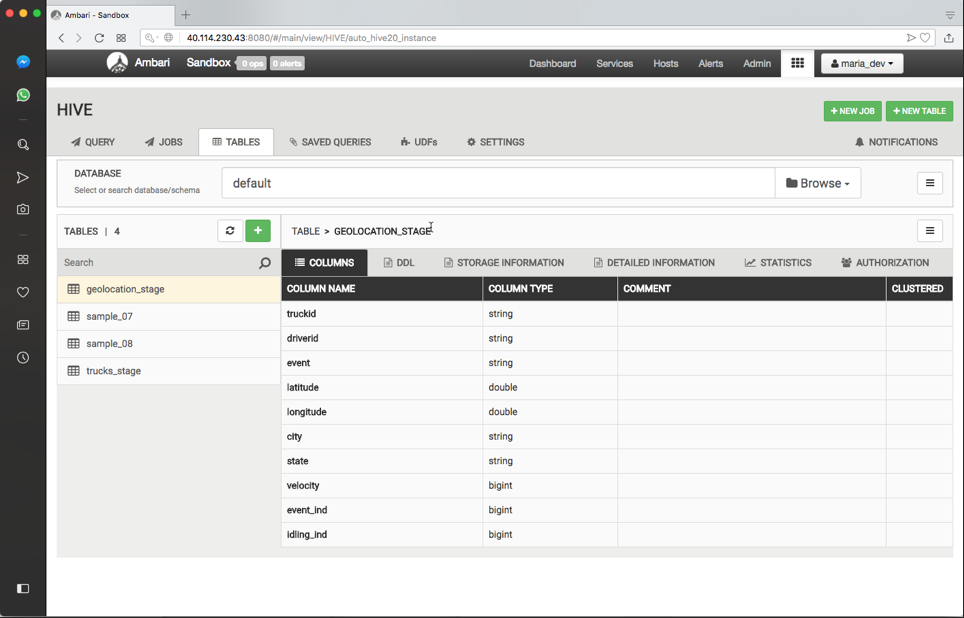

#### Load Sample Data of Trucks_Stage

Click on the **Load sample data** icon to generate and execute a select SQL statement to query
the table for a 100 rows. Notice your two new tables are currently empty.

* You can have multiple SQL statements within each editor worksheet, but each statement needs to be separated by a semicolon “;”.
* If you have multiple statements within a worksheet but you only want to run one of them just highlight the statement you want to run and then click the Execute button.

By default, when you create a table in Hive, a directory with the same name gets created in the `/apps/hive/warehouse` folder in HDFS. Using the Ambari Files User View, navigate to the `/apps/hive/warehouse` folder. You should see both a `geolocation_stage` and `trucks_stage` directory:

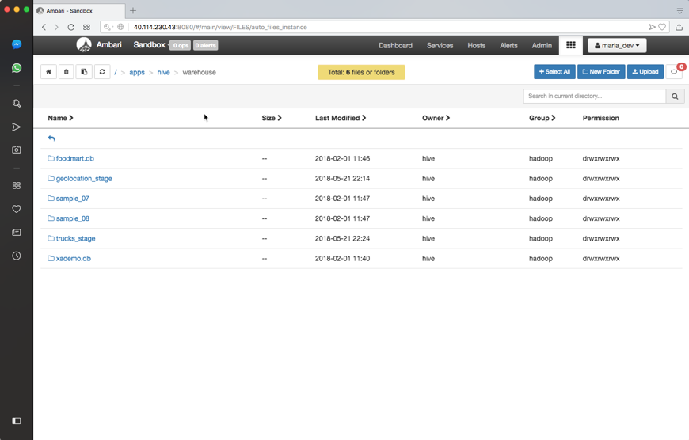

The definition of a Hive table and its associated metadata (i.e., the directory the data is stored in, the file format, what Hive properties are set, etc.) are stored in the Hive metastore, which on the Sandbox is a MySQL database.

### Load Data Into a Hive Table

Let’s load some data into your two Hive tables. Populating a Hive table can be done in various ways. A simple way to populate a table is to put a file into the directory associated with the table. 

1.	Using the Ambari Files User View, click on the **Move** icon next to the file `/user/maria_dev/truckdata/geolocation/geolocation.csv`. (Clicking on **Move** is similar to “cut” in cut-and-paste.)

	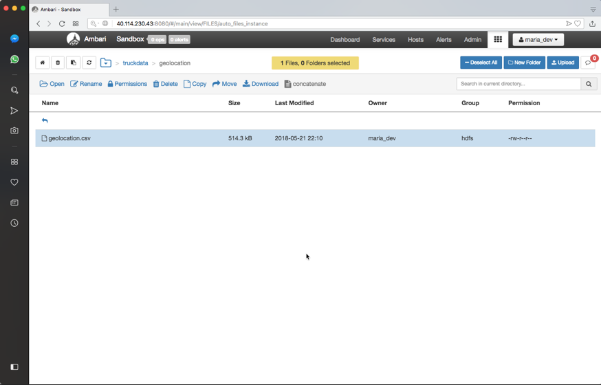
	
* The file name geolocation.csv is grayed out.
* The icons associated with the operations on the files are removed. This is to indicate that this file is in a special state that is ready to be moved.

2.	Now navigate to the destination path `/apps/hive/warehouse/geolocation_stage`.  You might notice that as you navigate through the directories that the file is pinned at the top.  Once you get to the appropriate directory click on the Paste icon to move the file:

	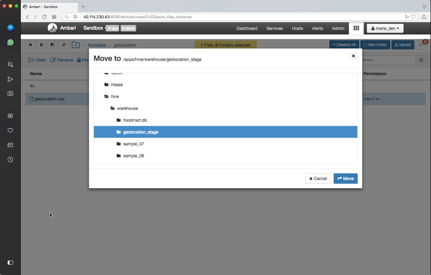
	
3.	Go back to the Ambari Hive View 2.0 and execute the following SQL statement to count the number of rows:

	```
	select count(*) from geolocation_stage
	```

	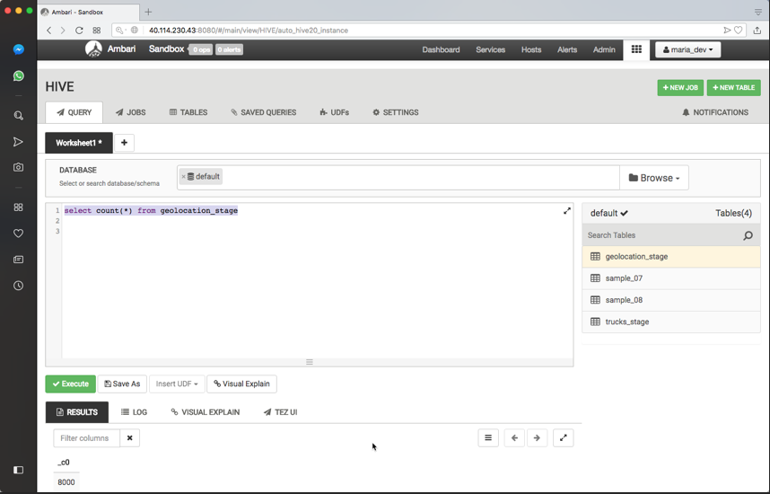

4.	There should be exactly 8000 rows in the table.

5.	To load trucks data we use another, more automatic approach through Hive. Enter the following SQL command into an empty Worksheet in the Ambari Hive User View:

	```
	LOAD DATA INPATH '/user/maria_dev/truckdata/trucks/trucks.csv' OVERWRITE INTO TABLE trucks_stage;
	```

6.	You should now see data in the `trucks_stage` table:

	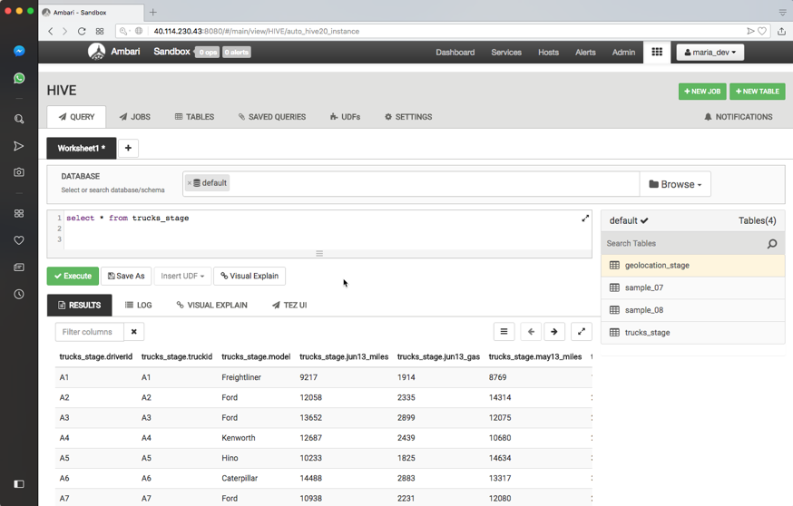

5.	Navigate to the `/user/maria_dev/truckdata/trucks`  folder. Notice the folder is empty! The **LOAD DATA INPATH** command moved the `trucks.csv` file from the `/user/maria_dev/truckdata/trucks` folder to the `/apps/hive/warehouse/trucks_stage` folder.

### Define an ORC Table in Hive

The Optimized Row Columnar (new Apache ORC project) file format provides a highly efficient way to store Hive data. It was designed to overcome limitations of the other Hive file formats. Using ORC files improves performance when Hive is reading, writing, and processing data.

To use the ORC format, specify ORC as the file format when creating the table:

```
CREATE TABLE … **STORED AS ORC**
```

In this step, you will create two ORC tables (geolocation and trucks) that are created from the text data in your **geolocation_stage** and **trucks_stage** tables.

1.	From the Ambari Hive View 2.0, execute the following table DDL to define a new table named geolocation:

	```
	CREATE TABLE geolocation STORED AS ORC AS SELECT * FROM geolocation_stage;
	```

2.	Refresh the **Database Info** on the right and verify you have a table named geolocation in the default database:

	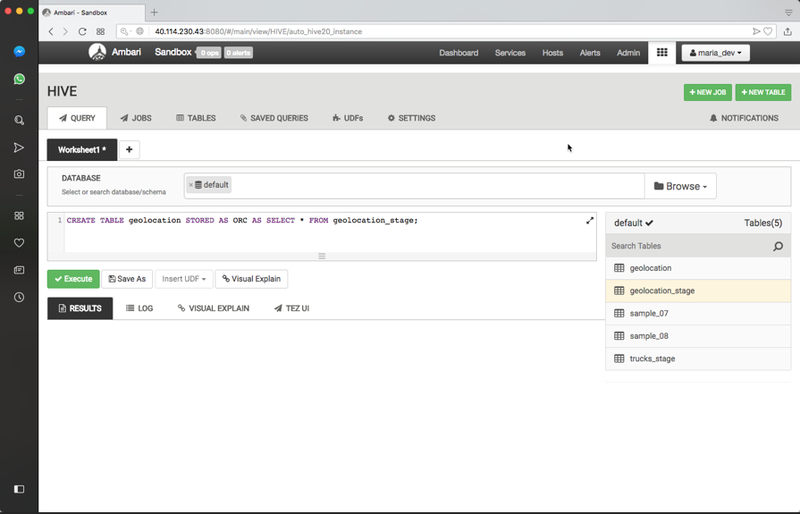

3.	View the contents of the **geolocation** table and notice it contains the same rows as **geolocation_stage**.
4.	Verify geolocation is an ORC Table, execute the following query:

	```
	DESCRIBE formatted geolocation;
	```
	
5.	Scroll down to the bottom of the **Results** tab and you will see a section labeled **Storage Information**. The output should look like:

	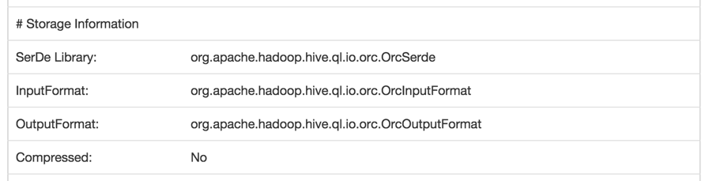

6.	Execute the following query to define a new ORC table named trucks that contains the data from **trucks_stage**:

	```
	CREATE TABLE trucks STORED AS ORC TBLPROPERTIES ("orc.compress.size"="1024") AS SELECT * FROM trucks_stage;
	```
	
7.	Refresh the Database Info on the right and view the contents of trucks:

	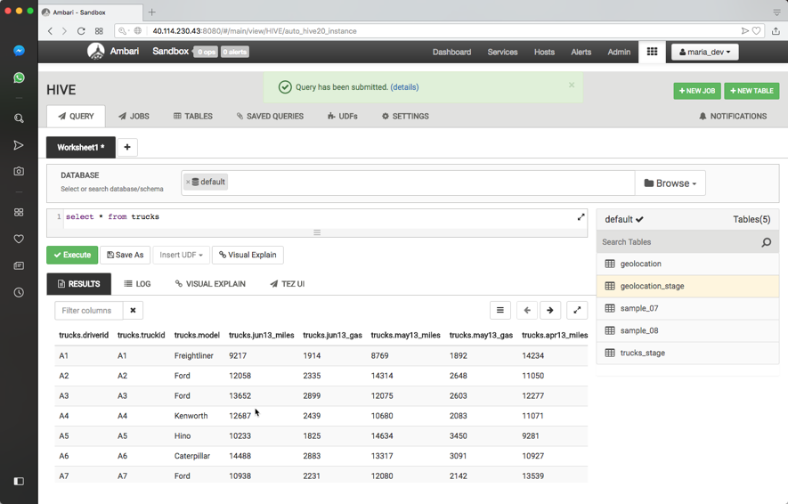

8.	If you want to try running some of these commands from the Hive Shell, follow the following steps from your terminal shell (or putty if using Windows):

	```
	[gus@sandbox ~]$ hive
	hive> select * from trucks;
	```
	
### Explore Hive Settings
1.	Open the Ambari Dashboard in another tab by right clicking on the Ambari icon:

	

2.	Go to the Hive page then select the Configs tab then click on Settings tab:

	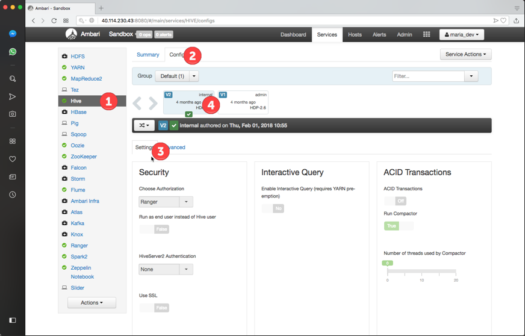

	1.	Hive Page
	2.	Hive Configs Tab
	3.	Hive Settings Tab
	4.	Version History of Configuration
3.	Scroll down to the Optimization Settings:

	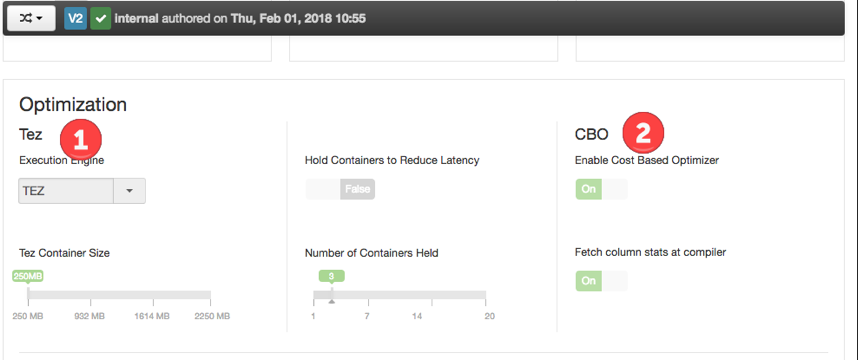

In the above screenshot we can see:

	1.	Tez is set as the optimization engine
	2.	Cost Based Optimizer (CBO) is turned on

This shows the new HDP 2.4 Ambari Smart Configurations, which simplifies setting configurations

* Hadoop is configured by a **collection of XML files**.
* In early versions of Hadoop, operators would need to do **XML editing** to **change settings**.  There was no default versioning.
* Early Ambari interfaces made it **easier to change values** by showing the settings page with dialog boxes for the various settings and allowing you to edit them.  However, you needed to know what needed to go into the field and understand the range of values.
* Now with Smart Configurations you can **toggle binary features** and use the slider bars with settings that have ranges.

4.	By default the key configurations are displayed on the first page. If the setting you are looking for is not on this page you can find additional settings in the Advanced tab:

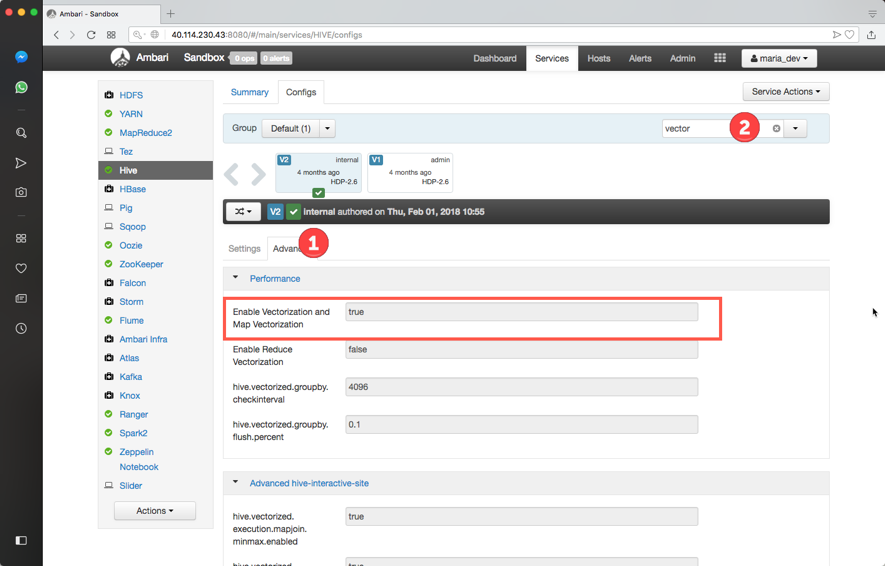

For example, if we wanted to improve SQL performance, we can use the new Hive vectorization features. These settings can be found and enabled by following these steps:

1. Click on the Advanced tab and scroll to find the property
1. Or, start typing in the property into the property search field and then this would filter the setting you scroll for.

As you can see from the green circle above, the **Enable Vectorization and Map Vectorization** is turned on already.

## Analyze the Trucks Data

Next we will be using Hive to analyze derived data from the geolocation and trucks tables. 

Let’s get started with the first transformation.   We want to calculate the miles per gallon for each truck. We will start with our truck data table.  We need to sum up all the miles and gas columns on a per truck basis. Hive has a series of functions that can be used to reformat a table. The keyword LATERAL VIEW is how we invoke things. The stack function allows us to restructure the data into 3 columns labeled rdate, gas and mile (ex: ‘june13’, june13_miles, june13_gas) that make up a maximum of 54 rows. We pick truckid, driverid, rdate, miles, gas from our original table and add a calculated column for mpg (miles/gas).  And then we will calculate average mileage.

Let’s create the table truck_milage from existing trucking data.

1.	Using the Ambari Hive View 2.0, execute the following query:

	```
	CREATE TABLE truck_mileage 
	STORED AS ORC AS SELECT truckid, driverid, rdate, miles, gas, miles / gas mpg 
	FROM trucks 
	LATERAL VIEW stack(54, 'jun13',jun13_miles,jun13_gas,'may13',may13_miles,may13_gas,'apr13',apr13_miles,apr13_gas,'mar13',mar13_miles,mar13_gas,'feb13',feb13_miles,feb13_gas,'jan13',jan13_miles,jan13_gas,'dec12',dec12_miles,dec12_gas,'nov12',nov12_miles,nov12_gas,'oct12',oct12_miles,oct12_gas,'sep12',sep12_miles,sep12_gas,'aug12',aug12_miles,aug12_gas,'jul12',jul12_miles,jul12_gas,'jun12',jun12_miles,jun12_gas,'may12',may12_miles,may12_gas,'apr12',apr12_miles,apr12_gas,'mar12',mar12_miles,mar12_gas,'feb12',feb12_miles,feb12_gas,'jan12',jan12_miles,jan12_gas,'dec11',dec11_miles,dec11_gas,'nov11',nov11_miles,nov11_gas,'oct11',oct11_miles,oct11_gas,'sep11',sep11_miles,sep11_gas,'aug11',aug11_miles,aug11_gas,'jul11',jul11_miles,jul11_gas,'jun11',jun11_miles,jun11_gas,'may11',may11_miles,may11_gas,'apr11',apr11_miles,apr11_gas,'mar11',mar11_miles,mar11_gas,'feb11',feb11_miles,feb11_gas,'jan11',jan11_miles,jan11_gas,'dec10',dec10_miles,dec10_gas,'nov10',nov10_miles,nov10_gas,'oct10',oct10_miles,oct10_gas,'sep10',sep10_miles,sep10_gas,'aug10',aug10_miles,aug10_gas,'jul10',jul10_miles,jul10_gas,'jun10',jun10_miles,jun10_gas,'may10',may10_miles,may10_gas,'apr10',apr10_miles,apr10_gas,'mar10',mar10_miles,mar10_gas,'feb10',feb10_miles,feb10_gas,'jan10',jan10_miles,jan10_gas,'dec09',dec09_miles,dec09_gas,'nov09',nov09_miles,nov09_gas,'oct09',oct09_miles,oct09_gas,'sep09',sep09_miles,sep09_gas,'aug09',aug09_miles,aug09_gas,'jul09',jul09_miles,jul09_gas,'jun09',jun09_miles,jun09_gas,'may09',may09_miles,may09_gas,'apr09',apr09_miles,apr09_gas,'mar09',mar09_miles,mar09_gas,'feb09',feb09_miles,feb09_gas,'jan09',jan09_miles,jan09_gas ) dummyalias AS rdate, miles, gas;
	```
	
2.	To view the data generated by the script, click **Load Sample Data** icon in the Database Explorer next to truck_mileage. After clicking the next button once, you should see a table that lists each trip made by a truck and driver:

	

Now use Content Assist to build a query.
 
1.	Create a new **SQL Worksheet**. 
2.	Start typing in the **SELECT SQL** command, but only enter the first two letters SE
3.	Press **Ctrl+Space** to vie the content assist pop-up dialog.

	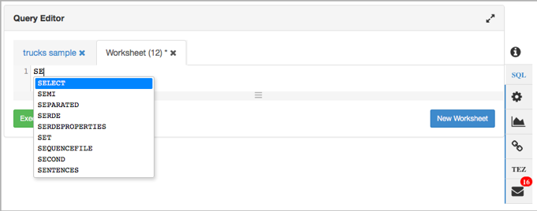

4.	 Type in the following query, using **Ctrl+space** throughout your typing so that you can get an idea of what content assist can do and how it works:

	```
	SELECT truckid, avg(mpg) avgmpg FROM truck_mileage GROUP BY truckid;
	```

5.	Click the **Save as …** button to save the query as **average mpg**:

	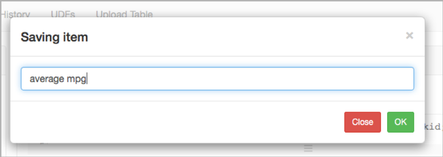

6.	Notice your query now shows up in the list of **Saved Queries**, which is one of the tabs at the top of the Hive User View.
7.	Execute the **average mpg** query and view its results.

It’s a fairly common pattern in Hive to persist results into a table. It is called [Create Table as Select (CTAS)](https://cwiki.apache.org/confluence/display/Hive/LanguageManual+DDL#LanguageManualDDL-CreateTableAsSelect%28CTAS%29). 

1.	Paste the following script into a new Worksheet, then click the Execute button:

	```
	CREATE TABLE avg_mileage
	STORED AS ORC
	AS
	SELECT truckid, avg(mpg) avgmpg
	FROM truck_mileage
	GROUP BY truckid;
	```

We now can create Hive tables with **CREATE TABLE** and load data into them using the **LOAD DATA INPATH** command. Additionally, we learned how to change the file format of the tables to ORC, so hive is more efficient at reading, writing and processing this data. We learned to grab parameters from our existing table using **SELECT {column_name…} FROM {table_name}** to create a new filtered table.
