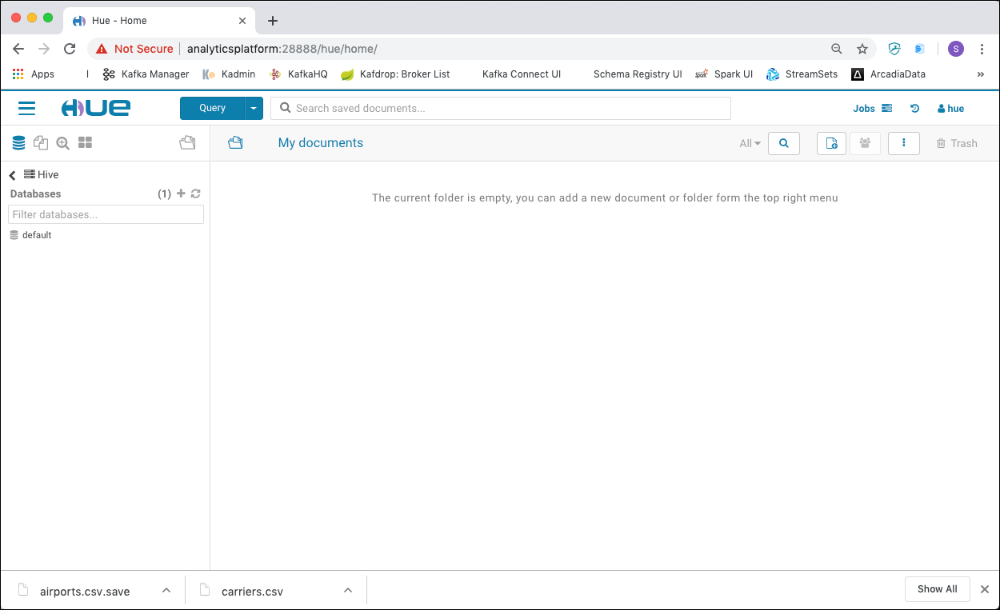
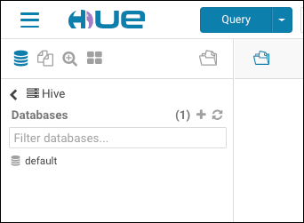
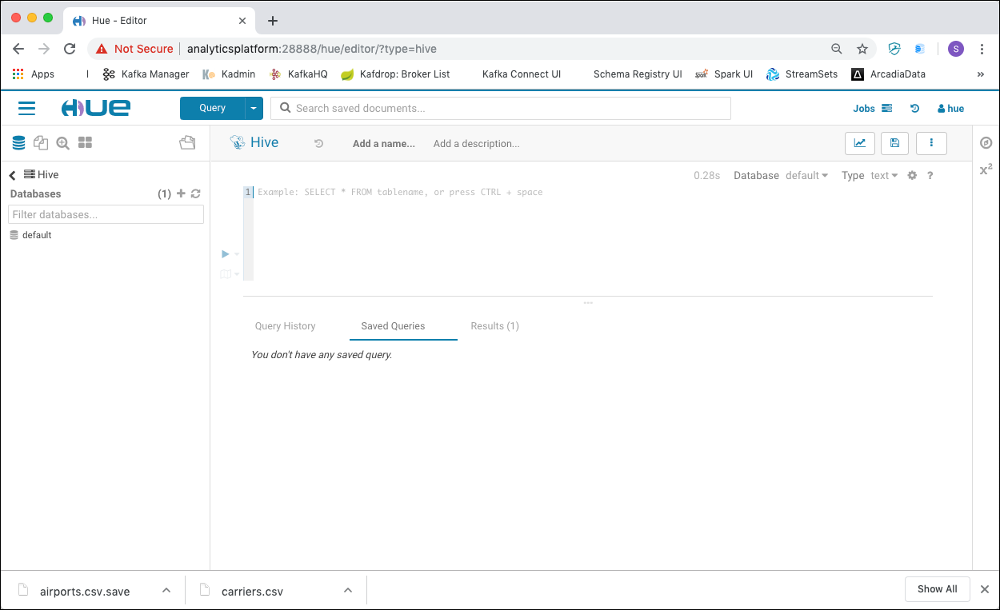
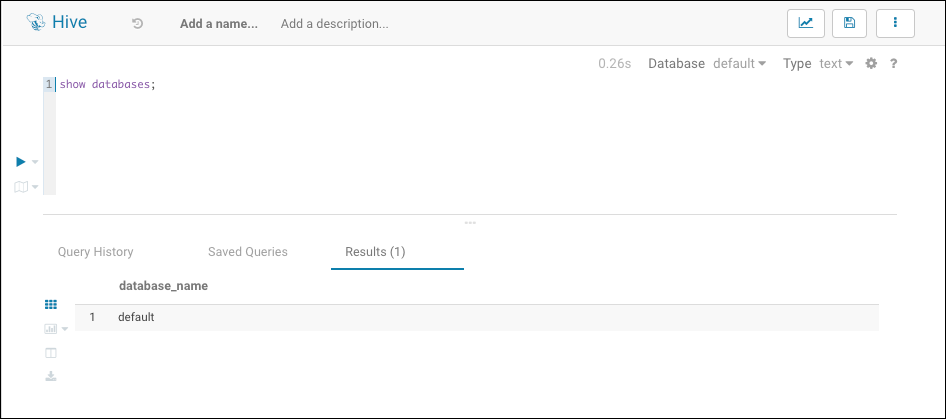
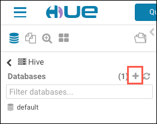
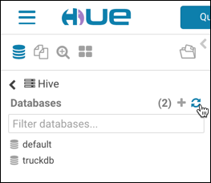
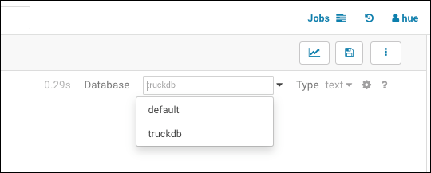
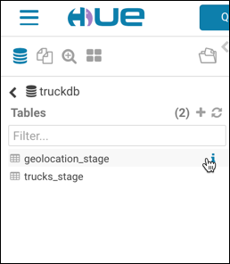
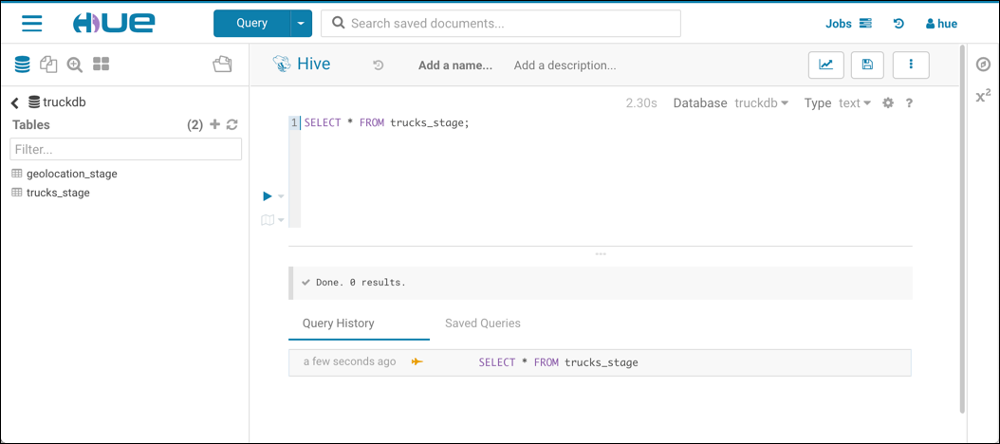
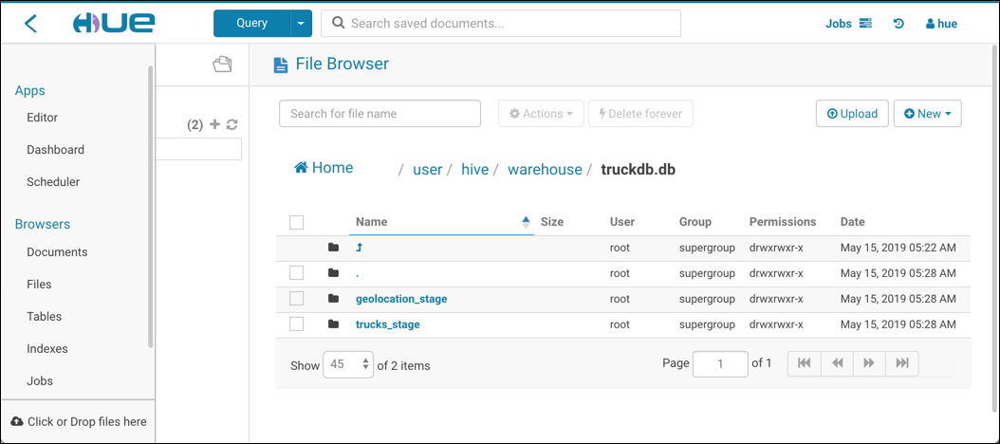

# Data Manipulation with Hive

## Introduction
In this workshop we will work with [Apache Hive](https://hive.apache.org/) to analyze data through SQL.

Hive is an SQL like query language that enables analysts familiar with SQL to run queries on large volumes of data. Hive has three main functions: data summarization, query and analysis. Hive provides tools that enable easy data extraction, transformation and loading (ETL).

We assume that the **Analytics platform** decribed [here](../01-environment) is running and accessible. 

##	 Accessing Hive

The Apache Hive ™ data warehouse software facilitates reading, writing, and managing large datasets residing in distributed storage using SQL. Structure can be projected onto data already in storage. A command line tool and JDBC driver are provided to connect users to Hive.

There various ways for accessing Hive. In this workshop we will use the following

 * **Hive CLI** - accessing Hive from the command line
 * **Hue** - a browser based GUI for working with a Hadoop cluster

There would also be the option to use **HiveServer2** and use Hive from any tool supporting ODBC or JDBC. But this is not covered in this workshop.

### Using the Hive CLI
The [Hadoop CLI](https://cwiki.apache.org/confluence/display/Hive/LanguageManual+Cli) allows us to work with Hadoop and HDFS through the command line. 
We can use it to create tables, load data into a table and query from tables.

In our environement, the Hadoop command is accessible inside the `hive-server` container. To connect to the Hive over the Hive CLI use the `hive` command. To get the help page run

```
docker exec -ti hive-server hive -h
```

and you should get the help page in return

```
$ docker exec -ti hive-server hive -h
SLF4J: Class path contains multiple SLF4J bindings.
SLF4J: Found binding in [jar:file:/opt/hive/lib/log4j-slf4j-impl-2.6.2.jar!/org/slf4j/impl/StaticLoggerBinder.class]
SLF4J: Found binding in [jar:file:/opt/hadoop-2.7.4/share/hadoop/common/lib/slf4j-log4j12-1.7.10.jar!/org/slf4j/impl/StaticLoggerBinder.class]
SLF4J: See http://www.slf4j.org/codes.html#multiple_bindings for an explanation.
SLF4J: Actual binding is of type [org.apache.logging.slf4j.Log4jLoggerFactory]
Unrecognized option: -h
usage: hive
 -d,--define <key=value>          Variable substitution to apply to Hive
                                  commands. e.g. -d A=B or --define A=B
    --database <databasename>     Specify the database to use
 -e <quoted-query-string>         SQL from command line
 -f <filename>                    SQL from files
 -H,--help                        Print help information
    --hiveconf <property=value>   Use value for given property
    --hivevar <key=value>         Variable substitution to apply to Hive
                                  commands. e.g. --hivevar A=B
 -i <filename>                    Initialization SQL file
 -S,--silent                      Silent mode in interactive shell
 -v,--verbose                     Verbose mode (echo executed SQL to the
                                  console)
```

To connect to Hive, just use the command without the `-h` option

```
docker exec -ti hive-server hive
```

Now on the command prompt `hive>` you can enter the hive commands. Let's list the available databases.

```
hive> show databases;
OK
default
Time taken: 0.94 seconds, Fetched: 2 row(s)
hive> 
```

### Using Hue

[Hue](http://gethue.com/) is a web-based interactive query editor in the Hadoop stack that lets you visualize and share data.

In a browser window, navigate to <http://analyticsplatform:28888> and sign in with user `hue` and password `hue`. You should be forwarded to the **Hue** homepage. 

If asked for the tour through Hue, either follow it, or just close the window. You should end up on the Hue homepage.



To access the Hive Query, navigate to the menu by clicking on the "database" icon in the top left corner. On the left you should see a menu showing Hive and the available databases, wich currently is just the default database.



If you click on the **Query** drop-down, the Query Editor will be shown in the detail section. 



Enter the commands into the query window and execute it either using the **>** icon to the left or hitting **CTRL + ENTER** on the keyboard. You can also use the `show databases` command to display the Hive databases here.



## Working with Hive

Apache Hive presents a relational view of data in HDFS and ensures that users need not worry about where or in what format their data is stored. Hive can display data from RCFile format, text files, ORC, JSON, parquet, sequence files and many of other formats in a tabular view. 

Through the use of SQL you can view your data as a table and create queries like you would in an RDBMS.

First let's upload the data needed for this workshop, using the techniques we have learned in the [HDFS Workshop](../02-hdfs/README.md).

### Upload Raw Data

In this workshop we are working with truck data. The files are also available in the `data-tranfer` folder of the Analytics Platform: [/01-environment/docker/data-transfer/flightdata](../01-environment/docker/data-transfer/truckdata).

In HDFS under the folder `/user/hue` create a new folder `truckdata` and upload the two files into that folder. 

Here are the commands to perform when using the **Hadoop Filesystem Command** on the commmand line

```
docker exec -ti namenode hadoop fs -mkdir -p /user/hue/truckdata/

docker exec -ti namenode hadoop fs -copyFromLocal /tmp/data-transfer/truckdata/geolocation.csv /user/hue/truckdata/
docker exec -ti namenode hadoop fs -copyFromLocal /tmp/data-transfer/truckdata/trucks.csv /user/hue/truckdata/

docker exec -ti namenode hadoop fs -ls /user/hue/truckdata/
```

Now with the raw data in HDFS, let's create some tables and load them. 

### Create a Database for the Truck Data

First let's create a Hive database for holding the tables.

You can either use the `CREATE DATABASE` statement in **Hive CLI** or **Hue**

```
CREATE DATABASE truckdb;
```

Or in Hue there is also a grapical way using the **+** sign next to the Databases list on the left side.



To see the databases in place, execute the following command in either **Hive CLI** or **Hue** 

```
SHOW databases;
```

In **Hue** you can also click on the refresh icon, next to the **Databases**.



### Create Hive Staging Tables

Now that you are familiar with the Hive User View, let’s create the initial staging tables for the geolocation and trucks data. In this section we will learn how to use the Ambari Hive User View to create four tables: geolocation_stage, trucking_stage, geolocation, trucking.
First we are gtoing to create the two tables to stage the data in their original csv text format and then will create two more tables where we will optimize the storage with ORC. Here is a visual representation of the Data Flow:


The following statements can either be executed using the Hive CLI or the **Hue Query Editor**. Screenshots of how to use it via **Hue** will be shown together with the description of the various tasks. 

Make sure that you switch to the `trucksdb` database created above, before you perform the next steps. You can either to it in **Hive CLI** using

```
use truckdb;
```

or in **Hue** using the Drop-Down on the top of the Query Editor



	
#### Create Table GEOLOCATION_STAGE for staging initial load

To create the table named `geolocation_stage` execute the following `CREATE TABLE` statement

```
CREATE TABLE geolocation_stage (truckid string, driverid string, event string, latitude DOUBLE, longitude DOUBLE, city string, state string, velocity BIGINT, event_ind BIGINT, idling_ind BIGINT)
	ROW FORMAT DELIMITED
	FIELDS TERMINATED BY ','
	STORED AS TEXTFILE
	TBLPROPERTIES ("skip.header.line.count"="1");
```

It reflects the format of the CSV file `geolocation.csv`. 


Click the green **Execute** button to run the command. 

Let’s review some aspects of the **CREATE TABLE** statements issued above. If you have an SQL background this statement should seem very familiar except for the last 3 lines after the columns definition:

* The **ROW FORMAT** clause specifies each row is terminated by the new line character.
* The **FIELDS TERMINATED BY** clause specifies that the fields associated with the
table (in our case, the two csv files) are to be delimited by a comma.
* The **STORED AS** clause specifies that the table will be stored in the TEXTFILE
format.

For details on these clauses consult the [Apache Hive Language Manual](https://cwiki.apache.org/confluence/display/Hive/LanguageManual+DDL).

#### Create Table `trucks_stage` for Staging Initial Load

Now create the `trucks_stage` table in the same way as the `geolocation_stage`. 

```
CREATE TABLE trucks_stage(driverid string, truckid string, model string, jun13_miles bigint, jun13_gas bigint, may13_miles bigint, may13_gas bigint, apr13_miles bigint, apr13_gas bigint, mar13_miles bigint, mar13_gas bigint, feb13_miles bigint, feb13_gas bigint, jan13_miles bigint, jan13_gas bigint, dec12_miles bigint, dec12_gas bigint, nov12_miles bigint, nov12_gas bigint, oct12_miles bigint, oct12_gas bigint, sep12_miles bigint, sep12_gas bigint, aug12_miles bigint, aug12_gas bigint, jul12_miles bigint, jul12_gas bigint, jun12_miles bigint, jun12_gas bigint,may12_miles bigint, may12_gas bigint, apr12_miles bigint, apr12_gas bigint, mar12_miles bigint, mar12_gas bigint, feb12_miles bigint, feb12_gas bigint, jan12_miles bigint, jan12_gas bigint, dec11_miles bigint, dec11_gas bigint, nov11_miles bigint, nov11_gas bigint, oct11_miles bigint, oct11_gas bigint, sep11_miles bigint, sep11_gas bigint, aug11_miles bigint, aug11_gas bigint, jul11_miles bigint, jul11_gas bigint, jun11_miles bigint, jun11_gas bigint, may11_miles bigint, may11_gas bigint, apr11_miles bigint, apr11_gas bigint, mar11_miles bigint, mar11_gas bigint, feb11_miles bigint, feb11_gas bigint, jan11_miles bigint, jan11_gas bigint, dec10_miles bigint, dec10_gas bigint, nov10_miles bigint, nov10_gas bigint, oct10_miles bigint, oct10_gas bigint, sep10_miles bigint, sep10_gas bigint, aug10_miles bigint, aug10_gas bigint, jul10_miles bigint, jul10_gas bigint, jun10_miles bigint, jun10_gas bigint, may10_miles bigint, may10_gas bigint, apr10_miles bigint, apr10_gas bigint, mar10_miles bigint, mar10_gas bigint, feb10_miles bigint, feb10_gas bigint, jan10_miles bigint, jan10_gas bigint, dec09_miles bigint, dec09_gas bigint, nov09_miles bigint, nov09_gas bigint, oct09_miles bigint, oct09_gas bigint, sep09_miles bigint, sep09_gas bigint, aug09_miles bigint, aug09_gas bigint, jul09_miles bigint, jul09_gas bigint, jun09_miles bigint, jun09_gas bigint, may09_miles bigint, may09_gas bigint, apr09_miles bigint, apr09_gas bigint, mar09_miles bigint, mar09_gas bigint, feb09_miles bigint, feb09_gas bigint, jan09_miles bigint, jan09_gas bigint)
	ROW FORMAT DELIMITED
	FIELDS TERMINATED BY ','
	STORED AS TEXTFILE
	TBLPROPERTIES ("skip.header.line.count"="1");
```

The structure and properties again refelects the format of the CSV file `trucks.csv`. It is a very wide table, representing the many columns of the CSV file. 

### Verify that the 2 new tables exist

To verify the tables were defined successfully, in **Hue** or **Hive CLI** execute

```
show tables;
```

In **Hue** you navigate into the database on the left side and you should see the tables. If not you have to hit the refresh icon. 



So we have created two tables, but do they already contain the data? A simple query can answer that question

```
SELECT * FROM trucks_stage;
```

If you are using **Hue**, then make sure that you select the right database in the drop-down on the top of the Query Browser.



We can see that the table does not hold any data. This would be the same for the other table as well.

We have created the tables in the **Hive Datawarehouse**, but our files in HDFS are located somewhere else. By default, when you create a table in Hive, a directory with the same name gets created in the `/user/hive/warehouse` folder in HDFS. Using the **File Browser**, navigate to this `/user/hive/warehouse` and you should find a `truckdb.db` folder, which holds one folder for each table. 



Both the `geolocation_stage` and the `trucks_stage` are currently empty, although the table is fully functioning, which is the reason why the SELECT query before returned zero rows. 

We could have created the table as **EXTERNAL** and link it with the location of the file in the `CREATE TABLE` clause. 

In this workshop we will manually move the data from the HDFS folder to the right place.

### Load data into the Staging tables

The definition of a Hive table and its associated metadata (i.e., the directory the data is stored in, the file format, what Hive properties are set, etc.) are stored in the Hive metastore, which in our environment is located in a PostgreSQL instance.

Let’s load the data into your two Hive tables. Populating a Hive table can be done in various ways. A simple way to populate a table is to put a file into the directory associated with the table. 

#### Move the file using HDFS commands

In the **File Browser** View, navigate to the file `/user/hue/truckdata/geolocation.csv` and select it. Now click on **Actions** | **Move** and select the `/user/hive/warehouse/truckdb.db/geolocation-stage` folder as the **Move to** target and click **Move**. The file has now been moved to the Hive warehouse. 

Another query on the table should now return the data:

```
SELECT * FROM geolocation_stage;
```

#### Use the `LOAD DATA INPATH` command

To load the trucks data we use another, more automatic approach through Hive. Execute the following SQL command

```
LOAD DATA INPATH '/user/hue/truckdata/trucks.csv' OVERWRITE INTO TABLE trucks_stage;
```

this also copies the data from the HDFS folder we have uploaded the data to the folder of the `trucks_stage` table. 

A quick check with a SELECT reveals that it has worked

```
SELECT COUNT(*) FROM trucks_stage;
```

**Note**: using this approach, we don't have to know exactly where the data in the warehouse is located, Hive is doing that work for us. 

If we now navigate back to the `/user/hue/truckdata`  folder, we can see that it is empty! We have successfully moved the data into the Hive warehouse. 

The next step will be to provide that data to potential consumers in a more efficient manner by usiing an columnar format instead of a text format. 

### Define an ORC Table in Hive

The Optimized Row Columnar (new Apache ORC project) file format provides a highly efficient way to store Hive data. It was designed to overcome limitations of the other Hive file formats. Using ORC files improves performance when Hive is reading, writing, and processing data.

To use the ORC format, specify ORC as the file format when creating the table `CREATE TABLE ... STORED AS ORC`

We will create two ORC tables, one for geolocation and one for trucks, which will be created from the data in the **geolocation_stage** and **trucks_stage** tables (which are based on the less optimal text format).

```
CREATE TABLE geolocation 
STORED AS ORC AS 
SELECT * 
FROM geolocation_stage;
```

We have sucessfully moved our raw data from the stating zone into the refined zone. 
In real life we might also perform some cleansing and processing in that step.

To see that the new table alos holds the data, just perform a simple SELECT query

```
SELECT * 
FROM geolocation
LIMIT 10;
```

To verify that the `geolocation` table is using the ORC format, execute the following query

```
DESCRIBE formatted geolocation;
```

The result should be similar to the one shown below
	
```
hive> DESCRIBE formatted geolocation;
OK
# col_name            	data_type           	comment

truckid             	string
driverid            	string
event               	string
latitude            	double
longitude           	double
city                	string
state               	string
velocity            	bigint
event_ind           	bigint
idling_ind          	bigint

# Detailed Table Information
Database:           	truckdb
Owner:              	root
CreateTime:         	Wed May 15 06:07:30 UTC 2019
LastAccessTime:     	UNKNOWN
Retention:          	0
Location:           	hdfs://namenode:8020/user/hive/warehouse/truckdb.db/geolocation
Table Type:         	MANAGED_TABLE
Table Parameters:
	COLUMN_STATS_ACCURATE	{\"BASIC_STATS\":\"true\"}
	numFiles            	1
	numRows             	8000
	rawDataSize         	3904000
	totalSize           	52817
	transient_lastDdlTime	1557900450

# Storage Information
SerDe Library:      	org.apache.hadoop.hive.ql.io.orc.OrcSerde
InputFormat:        	org.apache.hadoop.hive.ql.io.orc.OrcInputFormat
OutputFormat:       	org.apache.hadoop.hive.ql.io.orc.OrcOutputFormat
Compressed:         	No
Num Buckets:        	-1
Bucket Columns:     	[]
Sort Columns:       	[]
Storage Desc Params:
	serialization.format	1
Time taken: 0.124 seconds, Fetched: 39 row(s)
```	
	
We can see that the SerDe is infact the OrcSerde. Compare that with the `geolocation_stage` table. 

```
DESCRIBE formatted geolocation_stage;
```

Now let's perform the same operation also for the `trucks_stage` table. 

```
CREATE TABLE trucks 
STORED AS ORC TBLPROPERTIES ("orc.compress.size"="1024") AS 
SELECT * 
FROM trucks_stage;
```

With the two tables in place in a query-optimal form, let's perform some anlytics on it. 

## Analyze the Truck Data

Next we will be using Hive to analyze derived data from the `geolocation` and `trucks` tables. 

Let’s get started with the first transformation.  We want to calculate the miles per gallon for each truck. 

We will start with the truck table.  We need to sum up all the miles and gas columns on a per truck basis. Hive has a series of functions that can be used to reformat a table. The keyword `LATERAL VIEW` is how we invoke things. The stack function allows us to restructure the data into 3 columns labeled `rdate`, `mile` and `gas` (ex: `"june13"`, `june13_miles`, `june13_gas`) that make up a maximum of 54 rows. 

We pick `truckid`, `driverid`, `rdate`, `miles` and `gas` from our original table and add a calculated column `mpg` (miles/gas).

Let’s create the table `truck_milage` from existing trucking data.

```
CREATE TABLE truck_mileage 
STORED AS ORC AS SELECT truckid, driverid, rdate, miles, gas, miles / gas mpg 
FROM trucks 
LATERAL VIEW stack(54, 'jun13',jun13_miles,jun13_gas,'may13',may13_miles,may13_gas,'apr13',apr13_miles,apr13_gas,'mar13',mar13_miles,mar13_gas,'feb13',feb13_miles,feb13_gas,'jan13',jan13_miles,jan13_gas,'dec12',dec12_miles,dec12_gas,'nov12',nov12_miles,nov12_gas,'oct12',oct12_miles,oct12_gas,'sep12',sep12_miles,sep12_gas,'aug12',aug12_miles,aug12_gas,'jul12',jul12_miles,jul12_gas,'jun12',jun12_miles,jun12_gas,'may12',may12_miles,may12_gas,'apr12',apr12_miles,apr12_gas,'mar12',mar12_miles,mar12_gas,'feb12',feb12_miles,feb12_gas,'jan12',jan12_miles,jan12_gas,'dec11',dec11_miles,dec11_gas,'nov11',nov11_miles,nov11_gas,'oct11',oct11_miles,oct11_gas,'sep11',sep11_miles,sep11_gas,'aug11',aug11_miles,aug11_gas,'jul11',jul11_miles,jul11_gas,'jun11',jun11_miles,jun11_gas,'may11',may11_miles,may11_gas,'apr11',apr11_miles,apr11_gas,'mar11',mar11_miles,mar11_gas,'feb11',feb11_miles,feb11_gas,'jan11',jan11_miles,jan11_gas,'dec10',dec10_miles,dec10_gas,'nov10',nov10_miles,nov10_gas,'oct10',oct10_miles,oct10_gas,'sep10',sep10_miles,sep10_gas,'aug10',aug10_miles,aug10_gas,'jul10',jul10_miles,jul10_gas,'jun10',jun10_miles,jun10_gas,'may10',may10_miles,may10_gas,'apr10',apr10_miles,apr10_gas,'mar10',mar10_miles,mar10_gas,'feb10',feb10_miles,feb10_gas,'jan10',jan10_miles,jan10_gas,'dec09',dec09_miles,dec09_gas,'nov09',nov09_miles,nov09_gas,'oct09',oct09_miles,oct09_gas,'sep09',sep09_miles,sep09_gas,'aug09',aug09_miles,aug09_gas,'jul09',jul09_miles,jul09_gas,'jun09',jun09_miles,jun09_gas,'may09',may09_miles,may09_gas,'apr09',apr09_miles,apr09_gas,'mar09',mar09_miles,mar09_gas,'feb09',feb09_miles,feb09_gas,'jan09',jan09_miles,jan09_gas ) dummyalias AS rdate, miles, gas;
```
	
From that table, let's calculate the average mileage. Let's first find the correct result using just a query statement

```
SELECT truckid, avg(mpg) avgmpg FROM truck_mileage GROUP BY truckid;
```

When we are happy with the result, we can embedd the statement in a `CREATE TABLE ... AS ... ` 

```
CREATE TABLE avg_mileage
STORED AS ORC
AS
SELECT truckid, avg(mpg) avgmpg
FROM truck_mileage
GROUP BY truckid;
```

It’s a fairly common pattern in Hive to persist results into a table. It is called [Create Table as Select (CTAS)](https://cwiki.apache.org/confluence/display/Hive/LanguageManual+DDL#LanguageManualDDL-CreateTableAsSelect%28CTAS%29). 

## Summary

We have learnt that we can create Hive tables with **CREATE TABLE** and load data into them using the **LOAD DATA INPATH** command. Additionally, we have seen how to change the file format of the tables to ORC, so hive is more efficient at reading, writing and processing the underlying data. 

We have also learned how to grap column values from our existing table using **SELECT {column_name…} FROM {table_name}** to create a new table.
