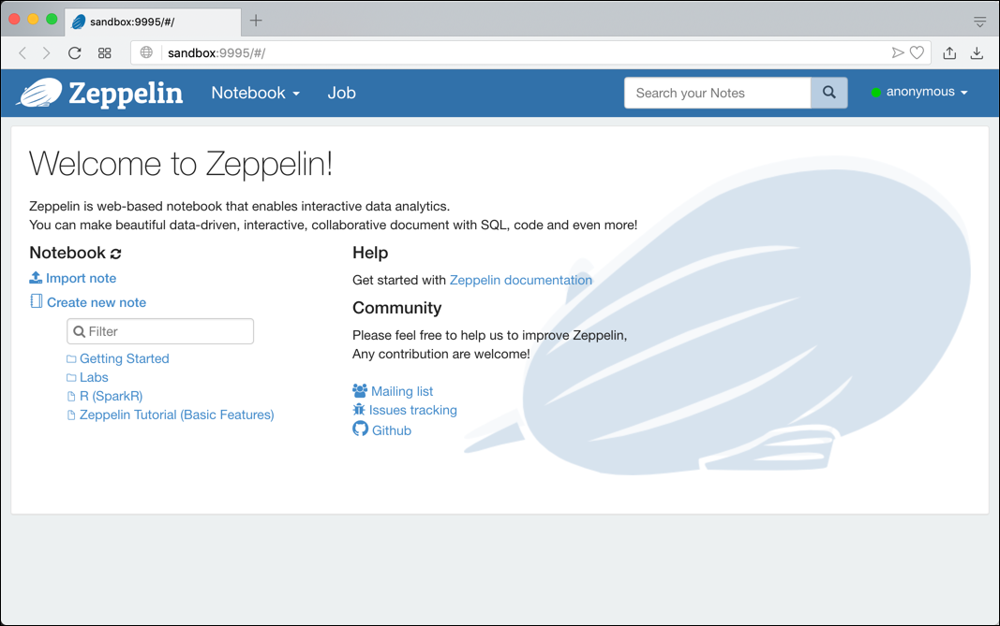
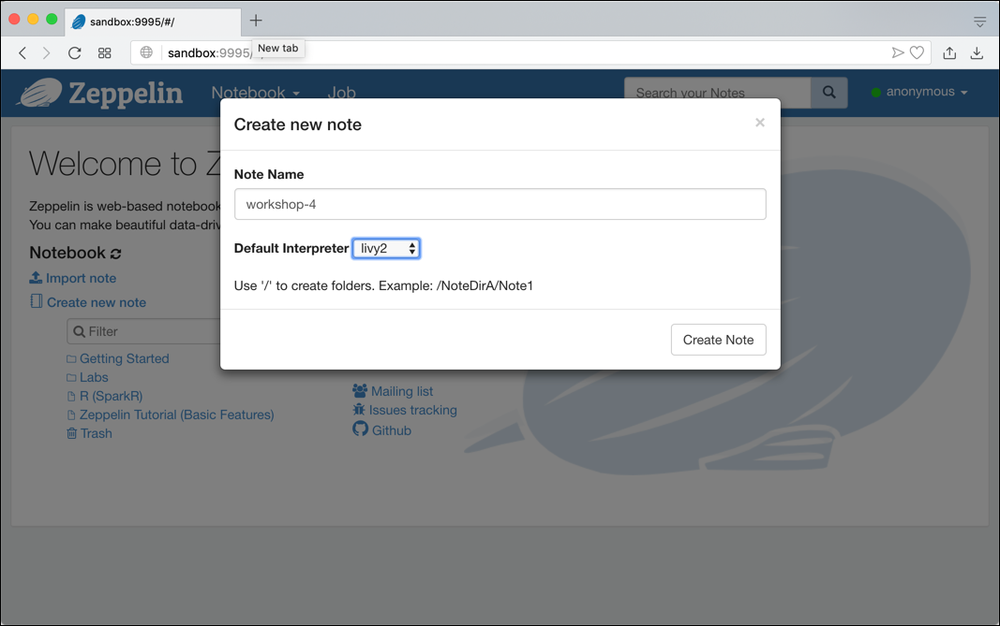
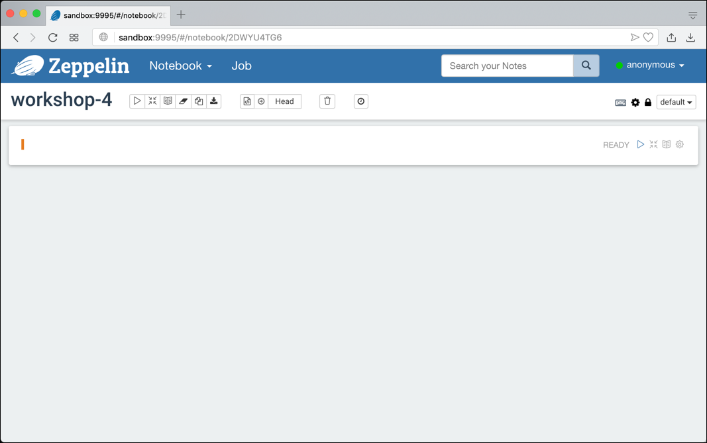
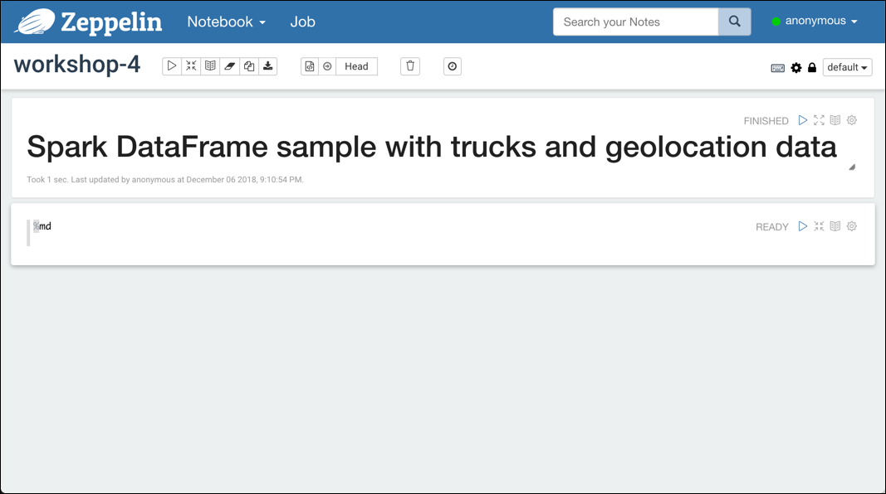
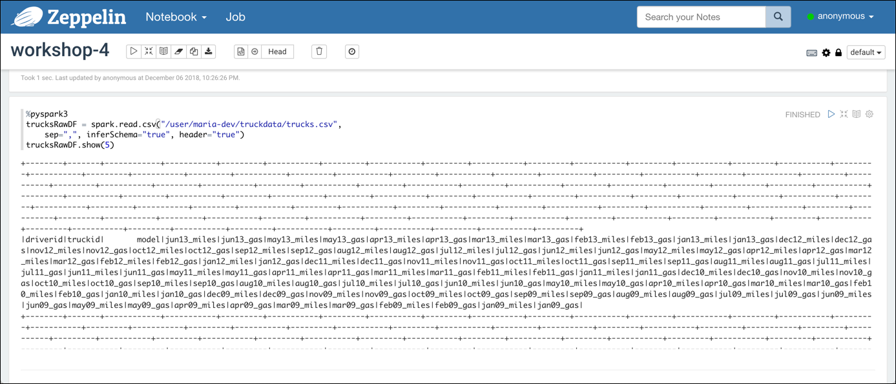
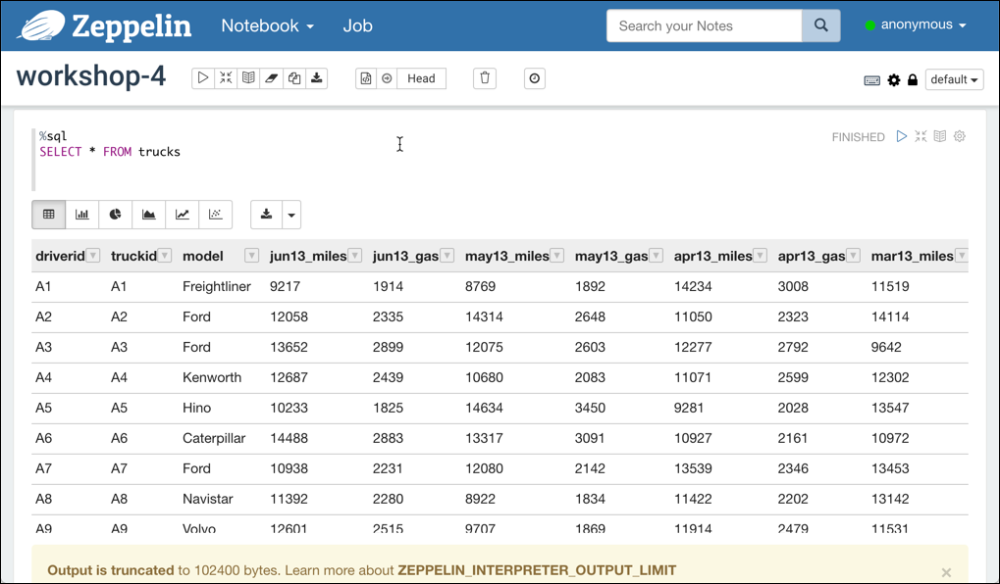

# Data Manipulation with Spark
In this workshop we will implement some basic operations using the Spark DataFrame API from Python. 

## Introduction
In this tutorial we will introduce working with Apache Spark DataFrames. We will use the same data as in Workshop 4 – Data Manipulation with Hive. This workshop can be done on the Hortonworks sandbox, using the data in Hive. On the other hand, it can also be done on a simpler environment using Docker. This is how it is shown below, but to adapt it to Hortonworks should be quite easy. 

## Pre-Requisites
Please ensure you complete the prerequisites before proceeding with this workshop.

* Create a HDP sandbox VM on Azure or download the latest Hortonworks Sandbox
* Load data into HDFS. Download the files necessary for this workshop as a ZIP File from here: <https://bit.ly/2jYXQBf>. Unzip the file and load the two files `trucks.csv` and `geolocation.csv` into HDFS into the folder `/user/maria-dev/truckdata`.

## Playing with Trucks and Geolocation data using Spark DataFrames
For the workshop we will use Zeppelin, started above. 

1.	In a browser window, navigate to <http://sandbox:9995>  and the Apache Zeppelin home screen should be shown. 

	

2.	To create a new Zeppelin notebook, click on the **Create new note** link. 

3.	Set the **Note Name** to `workshop-4` and leave the **Default Interpreter** set to `livy2`. 

	

4.	Click on **Create Note** and a new Notebook is created with one cell which is empty. 

	

Let’s now start working with the Trucks data, which we have uploaded with the file `trucks.csv`.

1.	Navigate to the first cell and start with a title. By using the `%md` directive we can switch to the Markdown interpreter, which can be used for displaying static text.

	```
	%md # Spark DataFrame sample with trucks and geolocation data
	```

2. Click on the triangle symbol on the right or enter **Shift+Enter** to run the paragraph.

3. The markdown code should now be rendered as a Heading-1 title.
 
	

5. First let's display the spark version we are using in the interpreter. Make sure that you use the directive `%pyspark3` and no longer `%md`. `%pyspark3` will tell Zepplin that you want to use the Python Spark API. Execute the cell using **Shift+Enter**.

	```
	%pyspark3
	spark.version
	```

5. Now let’s start using some code. First let’s import the spark python API. 

	```
	%pyspark3
	from pyspark.sql.types import *
	```

6.	Enter Shift+Enter to execute the paragraph. This will take a while, as the local Spark Cluster gets initialized. The successful execution will get confirmed by a Took NN sec …. message below the cell. 

### Access the truck data
7.	Next let’s import the trucks data into a DataFrame and show the first 5 rows. We use header=true to use the header line for naming the columns and specify to infer the schema.  

	```
	%pyspark3
	trucksRawDF = spark.read.csv("/user/maria-dev/truckdata/trucks.csv", 
    	sep=",", inferSchema="true", header="true")
	trucksRawDF.show(5)
	```
	
8.	The output will show the header line followed by the 5 data lines.

	


9.	Let’s display the schema, which has been derived from the data:

	```	
	%pyspark3
	trucksRawDF.printSchema()
	```

10.	The result should be a rather large schema only shown here partially. You can see that both string as well as integer datatypes have been used and that the names of the columns are derived from the header row of the csv file. 

	```
	root
	|-- driverid: string (nullable = true)
	|-- truckid: string (nullable = true)
	|-- model: string (nullable = true)
	|-- jun13_miles: integer (nullable = true)
	|-- jun13_gas: integer (nullable = true)
	|-- may13_miles: integer (nullable = true)
	|-- may13_gas: integer (nullable = true)
	|-- apr13_miles: integer (nullable = true)
	|-- apr13_gas: integer (nullable = true)
	...
	...
	```
	
11.	Next let’s ask for the total number of rows in the dataset. Should return 100. 

	```
	%pyspark3
	trucksRawDF.count()
	```
	
12.	You can also transform data easily into another format, just by writing the DataFrame out to a new file. Let’s create a JSON representation of the data. We will write it to a refined folder. 

	```
	%pyspark3
	trucksRawDF.write.json("/user/maria-dev/truckdata/truck-json")
	```
	
	Should you want to execute it a 2nd time, then you first have to delete the folder truck-json, otherwise the 2nd execution will throw an error. You can directly execute a shell command from Zeppelin, using the %sh directive. 

	```
	%sh
	hadoop fs -rm -R /user/maria-dev/truckdata/truck-json
	```
	
By that we have imported the truck data and it is available as the trucksRawDF Data Frame. We will come back to it later. First let’s do the same for the geolocation data. 
### Access the geolocation data

1.	Add some markdown to show that we are now working with geolocation data

	```
	%md ## Import Geolocation data
	```
	
2.	Read the data from the geolocation.csv file.

	```
	%pyspark3
	geolocationRawDF = spark.read.csv("/user/maria-dev/truckdata/geolocation.csv", 
	    sep=",", inferSchema="true", header="true")
	geolocationRawDF.show(5)
	```

3.	Again show the schema, which has been inferred.

	```
	%pyspark3
	geolocationRawDF.printSchema()
	```

4.	And print the number of rows in the DataFrame. Should return 8000.

	```
	%pyspark3
	geolocationRawDF.count()
	```

### Lets work with the data using Spark SQL

Now we also have the geolocation available in the DataFrame. Let’s work with it using SQL. 

1.	Add some markdown to start the new section

	```
	%md ## Let's use some SQL to work with the data
	```

2.	To use the data in a SQL statement, you have to register the DataFrame as a table. 

	```
	%pyspark3
	trucksRawDF.createOrReplaceTempView("trucks")
	geolocationRawDF.createOrReplaceTempView("geolocation")
	```

3.	We can always ask for the table registered by executing the show tables SQL command.

	```
	%pyspark3
	spark.sql("show tables").show()
	```

4.	With the tables in place, we can execute SQL directly from a cell, by using the `%sql` directive. 

	```
	%sql
	SELECT * FROM trucks
	```

5.	When executing such a cell, the output is shown in the nice grid view as shown in the screenshot below. 

	

	This is very helpful for testing various versions of a SQL statement, until you are sure about the result. 

6.	Play with some different statements on geolocation. 

	```
	%sql
	SELECT * FROM geolocation
	```

	```
	%sql
	SELECT * FROM geolocation WHERE event != 'normal'
	```

	```
	%sql
	SELECT driverid, COUNT(*) FROM geolocation 
	WHERE event != 'normal'
	GROUP BY driverid
	ORDER BY COUNT(*) DESC
	LIMIT 5
	```

7.	We have seen that we can register a DataFrame as a table and then use these tables directly in SQL. But the result of the SQL is “only” shown on the notebook. If we want to make use of SQL inside Spark, we can use the result of a SQL query to populate a new DataFrame. We can just take a statement we have previously tested using the `%sql` directive and execute it through a `spark.sql()` command.  The triple double-quotes allow to have the SQL on multiple lines.

	```
	%pyspark3
	unsafeDrivingDF = spark.sql("""
	                SELECT driverid, COUNT(*) occurance 
	                FROM geolocation WHERE event != 'normal'
	                GROUP BY driverid
	                ORDER BY COUNT(*) DESC
	                        """)
	unsafeDrivingDF.show()
	```

8.	Register the result as a table 

	```
	%pyspark3
	unsafeDrivingDF.createOrReplaceTempView("unsafe_driving")
	```

### Transform the data using Spark SQL
Now let’s use that technique to do some restructuring (transformation) of the data. 

1.	Let’s name that section of the notebook, using some markdown. 

	```
	%md ## Restructure the Trucks data
	```

2.	We will use the same statement as with the Hive workshop to unpivot the data, so that the different values by month are no longer in one result line per driver but on separate result lines. We can use the stack function available in Spark SQL as well, together with the LATERAL VIEW command. Let’s again first just test it using the %sql directive. 

	```
	%sql
	SELECT truckid, driverid, rdate, miles, gas, miles / gas mpg FROM trucks LATERAL VIEW stack(54, 'jun13',jun13_miles,jun13_gas,'may13',may13_miles,may13_gas,'apr13',apr13_miles,apr13_gas,'mar13',mar13_miles,mar13_gas,'feb13',feb13_miles,feb13_gas,'jan13',jan13_miles,jan13_gas,'dec12',dec12_miles,dec12_gas,'nov12',nov12_miles,nov12_gas,'oct12',oct12_miles,oct12_gas,'sep12',sep12_miles,sep12_gas,'aug12',aug12_miles,aug12_gas,'jul12',jul12_miles,jul12_gas,'jun12',jun12_miles,jun12_gas,'may12',may12_miles,may12_gas,'apr12',apr12_miles,apr12_gas,'mar12',mar12_miles,mar12_gas,'feb12',feb12_miles,feb12_gas,'jan12',jan12_miles,jan12_gas,'dec11',dec11_miles,dec11_gas,'nov11',nov11_miles,nov11_gas,'oct11',oct11_miles,oct11_gas,'sep11',sep11_miles,sep11_gas,'aug11',aug11_miles,aug11_gas,'jul11',jul11_miles,jul11_gas,'jun11',jun11_miles,jun11_gas,'may11',may11_miles,may11_gas,'apr11',apr11_miles,apr11_gas,'mar11',mar11_miles,mar11_gas,'feb11',feb11_miles,feb11_gas,'jan11',jan11_miles,jan11_gas,'dec10',dec10_miles,dec10_gas,'nov10',nov10_miles,nov10_gas,'oct10',oct10_miles,oct10_gas,'sep10',sep10_miles,sep10_gas,'aug10',aug10_miles,aug10_gas,'jul10',jul10_miles,jul10_gas,'jun10',jun10_miles,jun10_gas,'may10',may10_miles,may10_gas,'apr10',apr10_miles,apr10_gas,'mar10',mar10_miles,mar10_gas,'feb10',feb10_miles,feb10_gas,'jan10',jan10_miles,jan10_gas,'dec09',dec09_miles,dec09_gas,'nov09',nov09_miles,nov09_gas,'oct09',oct09_miles,oct09_gas,'sep09',sep09_miles,sep09_gas,'aug09',aug09_miles,aug09_gas,'jul09',jul09_miles,jul09_gas,'jun09',jun09_miles,jun09_gas,'may09',may09_miles,may09_gas,'apr09',apr09_miles,apr09_gas,'mar09',mar09_miles,mar09_gas,'feb09',feb09_miles,feb09_gas,'jan09',jan09_miles,jan09_gas ) dummyalias AS rdate, miles, gas
	```

3.	Once we are sure that it is working correctly, we can populate a new DataFrame with the results of the SQL query.

	```
	%pyspark3
	truckMileageDF = spark.sql("""
	SELECT truckid, driverid, rdate, miles, gas, miles / gas mpg FROM trucks LATERAL VIEW stack(54, 'jun13',jun13_miles,jun13_gas,'may13',may13_miles,may13_gas,'apr13',apr13_miles,apr13_gas,'mar13',mar13_miles,mar13_gas,'feb13',feb13_miles,feb13_gas,'jan13',jan13_miles,jan13_gas,'dec12',dec12_miles,dec12_gas,'nov12',nov12_miles,nov12_gas,'oct12',oct12_miles,oct12_gas,'sep12',sep12_miles,sep12_gas,'aug12',aug12_miles,aug12_gas,'jul12',jul12_miles,jul12_gas,'jun12',jun12_miles,jun12_gas,'may12',may12_miles,may12_gas,'apr12',apr12_miles,apr12_gas,'mar12',mar12_miles,mar12_gas,'feb12',feb12_miles,feb12_gas,'jan12',jan12_miles,jan12_gas,'dec11',dec11_miles,dec11_gas,'nov11',nov11_miles,nov11_gas,'oct11',oct11_miles,oct11_gas,'sep11',sep11_miles,sep11_gas,'aug11',aug11_miles,aug11_gas,'jul11',jul11_miles,jul11_gas,'jun11',jun11_miles,jun11_gas,'may11',may11_miles,may11_gas,'apr11',apr11_miles,apr11_gas,'mar11',mar11_miles,mar11_gas,'feb11',feb11_miles,feb11_gas,'jan11',jan11_miles,jan11_gas,'dec10',dec10_miles,dec10_gas,'nov10',nov10_miles,nov10_gas,'oct10',oct10_miles,oct10_gas,'sep10',sep10_miles,sep10_gas,'aug10',aug10_miles,aug10_gas,'jul10',jul10_miles,jul10_gas,'jun10',jun10_miles,jun10_gas,'may10',may10_miles,may10_gas,'apr10',apr10_miles,apr10_gas,'mar10',mar10_miles,mar10_gas,'feb10',feb10_miles,feb10_gas,'jan10',jan10_miles,jan10_gas,'dec09',dec09_miles,dec09_gas,'nov09',nov09_miles,nov09_gas,'oct09',oct09_miles,oct09_gas,'sep09',sep09_miles,sep09_gas,'aug09',aug09_miles,aug09_gas,'jul09',jul09_miles,jul09_gas,'jun09',jun09_miles,jun09_gas,'may09',may09_miles,may09_gas,'apr09',apr09_miles,apr09_gas,'mar09',mar09_miles,mar09_gas,'feb09',feb09_miles,feb09_gas,'jan09',jan09_miles,jan09_gas ) dummyalias AS rdate, miles, gas
	""")
	```

4.	Let’s see the schema of the DataFrame.

	```
	%pyspark3
	truckMileageDF.printSchema()
	```

5.	We can also work on the DataFrame in a fluent-API style, for example to only show data of a given driver. This is just the programmatic version as an alternative for using SQL.

	```
	%pyspark3
	truckMileageDF.filter(truckMileageDF.driverid=="A3").show(10)
	```

6.	Let’s write the truck-mileage data as a result to a Parquet formatted file. We use a similar statement as above when we wrote JSON, just using the parquet() method instead.

	```
	%pyspark3
	truckMileageDF.write.parquet('/user/maria-dev/truckdata/truckmileage-parquet')
	```
	
7.	Let's also register the truck mileage data as a table 

	```
	%pyspark3
	truckMileageDF.createOrReplaceTempView("truck_mileage")
	```	

### Simple Analytics on the data using Spark SQL
Now let’s do some simple analytics on the data, both using SQL and the fluent-API. 

1.	Let’s again start with a new section my using some markdown. 

	```
	%md ## Apply some analytics on the data
	```

2.	Calculate and display the average value of mpg by truck. Let’s first do it with SQL

	```
	%sql
	SELECT truckid, avg(mpg) avgmpg
	FROM truck_mileage
	GROUP BY truckid
	```

3.	We can do the same in a programmatic way using the fluent API

	```
	%pyspark3
	avgMpgByTruck = truckMileageDF.groupBy("truckId").agg({"mpg":"avg"})
	avgMpgByTruck.show()
	```

4.	Let’s calculate the total miles per driver, first testing the SQL statement using the %sql directive.

	```
	%sql
	SELECT driverid, sum(miles) totmiles
	FROM truck_mileage
	GROUP BY driverid
	```

5.	Then create a DataFrame with the result and register a table at the same time.

	```
	%pyspark3
	spark.sql("""
	        SELECT driverid, sum(miles) totmiles
	        FROM truck_mileage
	        GROUP BY driverid
	        """).createOrReplaceTempView("driver_milage")
	```

6.	Let’s see all the table we have available.

	```
	%pyspark3
	spark.sql("show tables").show()
	```

7.	Now let’s join the unsafe_driving table with the driver_mileage to see the number of occurences and the total miles driven by the driver.

	```
	%sql
	SELECT a.driverid,a.occurance,b.totmiles 
	FROM unsafe_driving a, driver_milage b 
	WHERE a.driverid=b.driverid
	```

8.	By extending the SQL statement form above (using it as an inline view), we can calculate a risk factor by driver. 

	```
	%sql
	SELECT driverid, occurance, totmiles, totmiles/occurance riskfactor 
	FROM (
	    SELECT a.driverid,a.occurance,b.totmiles 
	    FROM unsafe_driving a, driver_milage b 
	    WHERE a.driverid=b.driverid
	)
	```


