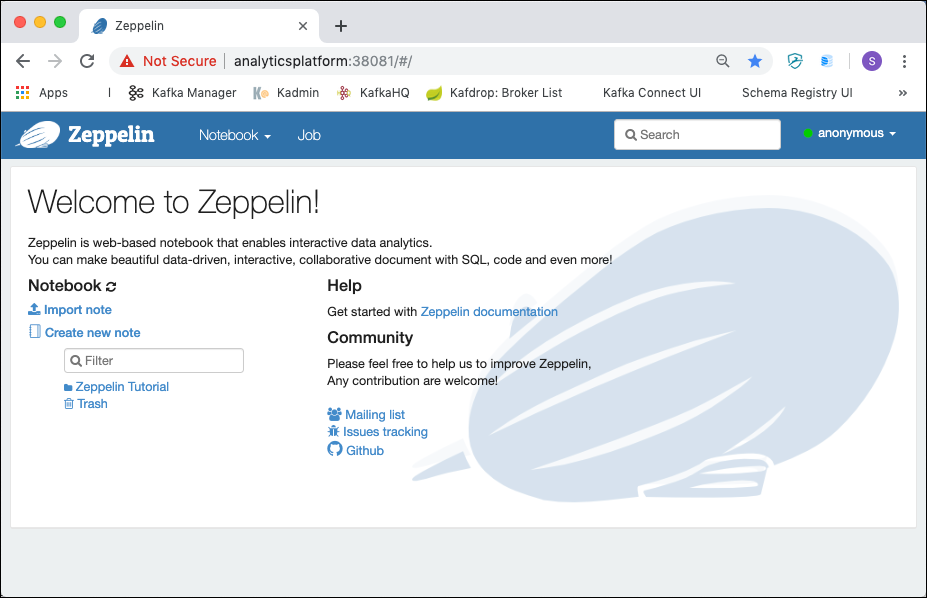
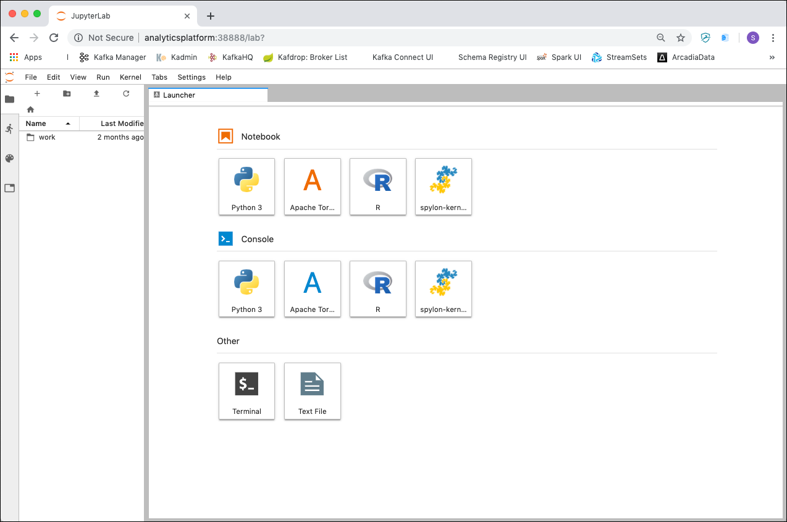

# Python Introduction

In this workshop you learn the basics of the Python programming language.

We assume that the **Analytics platform** decribed [here](../00-environment) is running and accessible. 

## Working with Python

Python is a scripting language, which makes it easy to learn and use. There are various ways for trying out python
 
 * Using the [Python Shell Interpreter](https://docs.python.org/3/tutorial/interpreter.html) - Command Line based
 * Using [Apache Zeppelin](https://zeppelin.apache.org/) - Notebook based
 * Using [Jupyter](https://jupyter.org/) - Notebook based

The first one can also be used by just installing Python locally, wheras the other two are available through the Analyticsplatform.

### Using Python Shell

If you have python installed locally, then you can start it by entering `python` in a terminal window.

```
gus@gusmacbook ~/w/g/v/safaribooks> python
Python 2.7.10 (default, Feb 22 2019, 21:17:52)
[GCC 4.2.1 Compatible Apple LLVM 10.0.1 (clang-1001.0.37.14)] on darwin
Type "help", "copyright", "credits" or "license" for more information.
>>>
``` 

You can see the version of python which is installed and `>>>` represents the command prompt where you can start entering commands. 

``` 
>>> print('hello world!')
hello world!
``` 

Instead of using Python locally, you can also access the Python Shell avaialbe inside the running Zeppelin or Jupyter container, using a `docker exec -ti <container-name> python`

In the Zepplin container you have both versions of Python 2.x and 3.x available. For 2.7.15 use the `python` command

``` 
bigdata@bigdata:~$ docker exec -ti zeppelin python
Python 2.7.15 (default, Aug 16 2018, 14:17:09)
[GCC 6.4.0] on linux2
Type "help", "copyright", "credits" or "license" for more information.
>>>
``` 

or for 3.6.6 use the `python3` command instead. 

``` 
bigdata@bigdata:~$ docker exec -ti zeppelin python3
Python 3.6.6 (default, Aug 24 2018, 05:04:18)
[GCC 6.4.0] on linux
Type "help", "copyright", "credits" or "license" for more information.
>>>
``` 

In the Jupyter container you only have Python 3.x. Perform the following command to run it

``` 
bigdata@bigdata:~$ docker exec -ti jupyter python
Python 3.7.1 | packaged by conda-forge | (default, Mar 13 2019, 12:57:14)
[GCC 7.3.0] :: Anaconda, Inc. on linux
Type "help", "copyright", "credits" or "license" for more information.
>>>
``` 

To leave the Python shell, enter `quit()` on the `>>>`command prompt.

### Using Apache Zeppelin

In a browser window, navigate to <http://analyticsplatform:38081> and you should see the Apache Zeppelin homepage



From here you can either create a new Notebook or import an existing one. 

Import the `Python Tutorial 1.json` and execute each single cell and make sure you understand what happens. 

Import the `Python Tutorial 2.json` and execute each single cell and make sure you understand what happens. 

### Using Jupyter

In a browser window, navigate to <http://analyticsplatform:38888>. 
Enter `abc123` into the **Password or token** field and click **Log in**. 

You should be forwared to the Jupyter homepage. 




## Python Tutorial

* [Python Tutorial 1](./python-tutorial-1.md)
* [Python Tutorial 2](./python-tutorial-2.md)